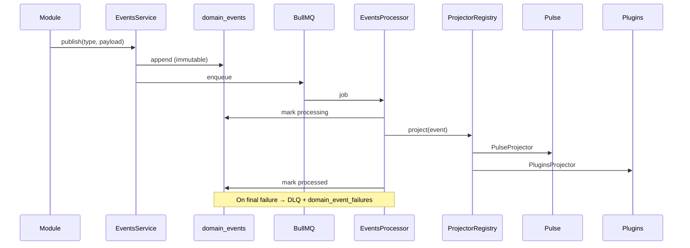

# ADR-006: Postgres Event Store + BullMQ Transport

**Status:** Accepted  
**Date:** 2026-07-25  
**Phase:** 1.5A  
**Deciders:** Founding Principal Engineer

---

## Context

Sprint 1.5 requires an immutable, replayable event backbone. ADR-005 established BullMQ for transport and Pulse for projections, but events were ephemeral (removed after processing). The platform philosophy requires every object to answer: **What happened?** — that answer lives in the event store.

---

## Decision

1. **`domain_events` table** — append-only Postgres store with monotonic `sequence`, correlation/causation/trace IDs, schema `version`, and processing `status`.
2. **`domain_event_failures` table** — dead letter audit trail per failed projection attempt.
3. **Persist-then-publish** — `EventsService.publish()` writes to Postgres before enqueueing to BullMQ.
4. **Projector registry** — side effects (Pulse, Plugins) run through `EventProjector` implementations, not direct processor calls.
5. **DLQ queue** — `domain-events-dlq` for events that exhaust retries.
6. **`@grayscale/platform` package** — event catalog, envelope types, projector interfaces (no NestJS coupling).

---

## Event Flow

---

## Alternatives Considered

| Alternative | Rejected Because |
|-------------|------------------|
| BullMQ-only (no Postgres) | No replay, no audit, violates platform philosophy |
| Kafka | Operational cost; Postgres sufficient at current scale |
| Event sourcing all aggregates | Over-engineering; we need event log + existing CRUD tables |
| In-process EventEmitter | Not durable, not observable across processes |

---

## Consequences

**Positive:**
- Full audit trail and correlation tracing
- Replay for new projectors (Memory Index, Knowledge Graph in 1.5B/C)
- Versioned event catalog enables schema evolution
- Clean separation: store (truth) vs transport (delivery) vs projectors (side effects)

**Negative:**
- Extra write latency on every publish (acceptable for correctness)
- Storage growth — mitigated by future archival policy (not Sprint 1.5)

---

## References

- [EVENT_CATALOG.md](../platform/EVENT_CATALOG.md)
- [SPRINT_1_5_CORE_PLATFORM.md](../engineering/SPRINT_1_5_CORE_PLATFORM.md)
- ADR-005 (Pulse + Plugins)
