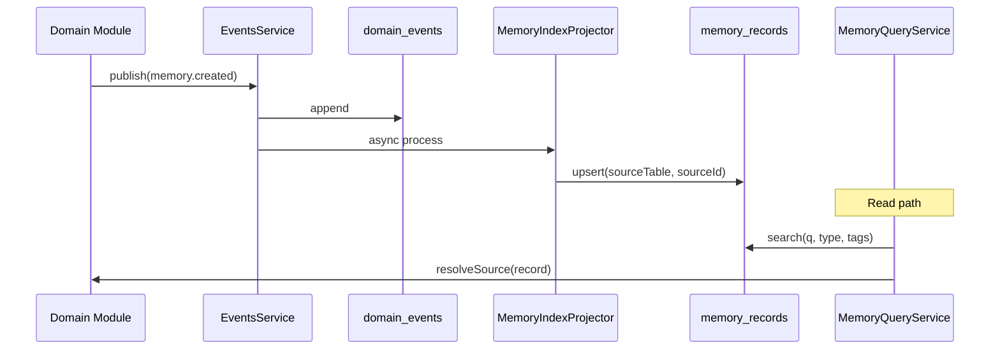

# ADR-007: Memory Index Facade

**Status:** Accepted  
**Date:** 2026-07-25  
**Phase:** 1.5B  
**Deciders:** Founding Principal Engineer

---

## Context

Project Grayscale's organizational memory is spread across `memories`, `journal_entries`, `timeline_events`, `bills`, `notifications`, and other domain tables. Executives and Mission Control need **one searchable interface** without migrating all data into a single polymorphic table (AIP-1).

---

## Decision

1. **`memory_records` index table** — denormalized search facade pointing to source entities via `(sourceTable, sourceId)`.
2. **Domain tables unchanged** — remain source of truth for CRUD.
3. **`MemoryIngestionService`** — upsert/remove index rows (event-driven + backfill).
4. **`MemoryQueryService`** — unified search with type, tag, text, and date filters.
5. **`MemoryIndexProjector`** — subscribes to 11 domain event types on the event bus.
6. **Platform contracts** — `MemoryRecord`, `MemoryIngestionPort`, `MemoryQueryPort` in `@grayscale/platform`.

---

## Data Flow

---

## Index Schema

| Field | Purpose |
|-------|---------|
| `memoryType` | Facade category (note, journal, bill, …) |
| `sourceTable` + `sourceId` | Pointer to domain entity (unique) |
| `title`, `summary`, `tags` | Searchable fields |
| `occurredAt` | When the memory happened (not when indexed) |
| `metadata` | Type-specific JSON |

**Future:** `embedding vector(1536)` column for semantic search (Sprint 2+). Postgres `vector` extension already enabled.

---

## Alternatives Considered

| Alternative | Rejected Because |
|-------------|------------------|
| Single universal `memories` table | High-risk migration; breaks Sprint 1 data |
| Search each table at query time | O(n tables); no unified ranking |
| Elasticsearch | Extra infra; Postgres sufficient now |
| Immediate pgvector | Premature without embedding pipeline |

---

## Consequences

**Positive:**
- Unified search without table rewrites
- Event-driven index stays in sync
- Backfill + replay for historical data
- Executives query one interface (`MemoryQueryPort`)

**Negative:**
- Dual-write via projector (mitigated by idempotent upsert)
- Index may lag milliseconds behind source (acceptable)

---

## References

- [MEMORY_ENGINE.md](../platform/MEMORY_ENGINE.md)
- AIP-1 in [CORE_PLATFORM_DESIGN_REVIEW.md](./CORE_PLATFORM_DESIGN_REVIEW.md)
- ADR-006 (Event Store)
