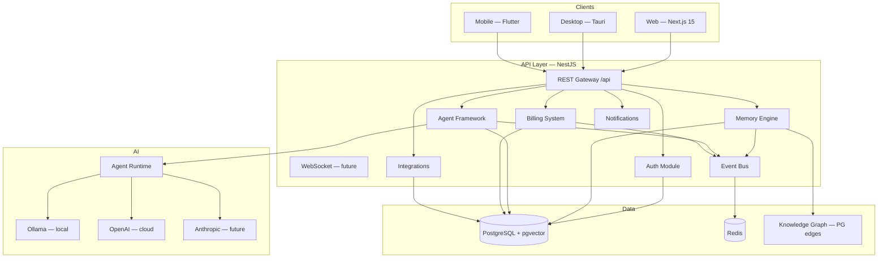
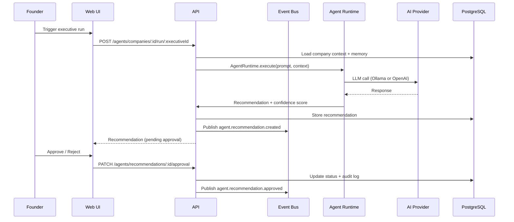
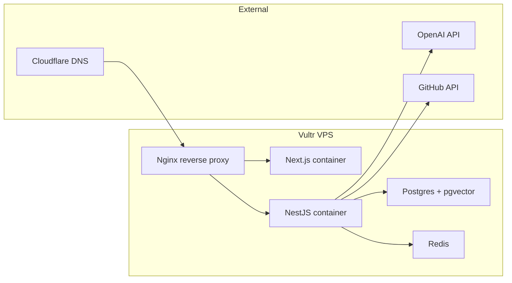
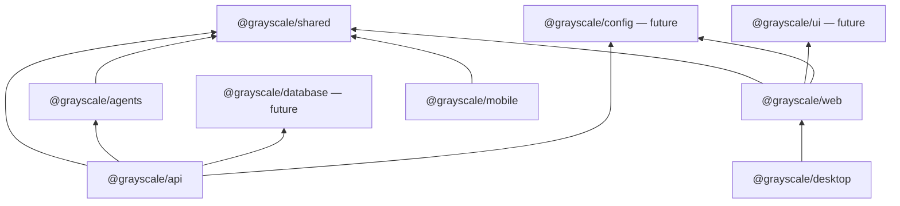

# Architecture Blueprint — Project Grayscale

**Sprint:** 1 — Platform Foundation  
**Date:** 2026-07-25  
**Status:** Design document — implementation follows Sprint plan

---

## System Context

Project Grayscale is an **AI Company Operating System** — a platform where founders manage their company with an AI executive team. Every module (Memory, Agents, Billing, Integrations) shares a common foundation.

---

## High-Level Architecture



---

## Layer Breakdown

### 1. Web (`apps/web`)
- **Stack:** Next.js 15 App Router, React 19, Tailwind CSS 4
- **Auth:** Client context + Next.js API proxy routes
- **Pages:** Landing, Auth, Dashboard, Mission Control, Experience tour
- **Future:** Shared `@grayscale/ui` component library

### 2. Desktop (`apps/desktop`)
- **Stack:** Tauri 2 + Rust shell wrapping Next.js static export
- **Priority:** P1 after web stabilizes
- **Unique value:** Local file access, Cursor adjacency, offline cache

### 3. Mobile (`apps/mobile`)
- **Stack:** Flutter 3.x
- **Priority:** P1 scaffold — notifications + briefings on-the-go
- **Shared:** Design tokens from `design-system/TOKENS.md`

### 4. Backend (`apps/api` — currently `backend/`)
- **Stack:** NestJS 11, Prisma 6, BullMQ, Passport JWT
- **Pattern:** Module-per-domain, DTO validation, Swagger docs
- **Global prefix:** `/api`

### 5. Database (PostgreSQL + pgvector)
- **ORM:** Prisma with migration-based schema management
- **Extensions:** `vector` for semantic search (Phase 2)
- **Knowledge Graph:** `knowledge_nodes` + `knowledge_edges` tables (not Neo4j)
- **Multi-tenancy:** `company_id` on all tenant-scoped tables + membership guards

### 6. Redis
- **Queues:** BullMQ domain event bus
- **Future:** Session cache, rate limiting, pub/sub for real-time

### 7. Vector Database
- **Phase 1–2:** pgvector extension in same Postgres instance
- **Why not Pinecone:** $0 cost, one backup target, sufficient to 1M vectors
- **Upgrade trigger:** >10M vectors or <50ms search SLA at scale

### 8. Event Bus
- **Implementation:** BullMQ on Redis
- **Events:** Typed `DomainEvent` union in `@grayscale/shared`
- **Flow:** Module action → EventsService.publish → EventsProcessor → agent routing (future)
- **Why not Kafka:** Overkill below 100k events/day; same Redis instance

### 9. Authentication
```
Register/Login → bcrypt hash → JWT access token (15m)
                              → JWT refresh token (7d) [Sprint 1 TODO]
                              → httpOnly cookie storage [Sprint 1 TODO]
Phase 2: WebAuthn passkeys
Phase 3: SSO (SAML/OIDC) for enterprise
```

### 10. Agent Framework (design only — Sprint 2+)
```typescript
abstract class BaseExecutiveAgent {
  identity: ExecutiveIdentity;
  memory: AgentMemoryInterface;
  knowledge: KnowledgeGraphInterface;
  reasoning: ReasoningEngine;
  tasks: TaskQueue;
  events: EventPublisher;
  permissions: PermissionScope;
  
  abstract execute(context: AgentContext): Promise<AgentResult>;
  
  requestApproval(action: ProposedAction): ApprovalRequest;
  recommend(insight: Insight): Recommendation;
  audit(trail: AuditEntry): void;
}
```

Every executive (Athena, Atlas, Ledger, etc.) inherits this base.

### 11. Notification System
- **Phase 1:** In-app notifications table + polling
- **Phase 2:** WebSocket push + email (Resend/Postmark)
- **Phase 3:** Mobile push (FCM/APNs via Flutter)

### 12. Billing System
- **Founder bills:** Bill reminders, due dates, exports (built)
- **SaaS billing:** Stripe subscriptions (Sprint 5+)
- **Keep separate:** `modules/billing` (founder) vs `modules/subscriptions` (SaaS)

### 13. Memory Engine
- **CRUD:** Memory items with categories, tags, full-text search
- **Journal:** Daily entries with AI summarization
- **GitHub sync:** Commits → memory items
- **Future:** pgvector embeddings for semantic recall

### 14. Plugin System (future)
```
PluginRegistry → PluginManifest → HookPoints
  - onMemoryCreate
  - onAgentRecommendation
  - onBillDue
  - onIntegrationConnect
```

### 15. API Layer
- REST first, GraphQL deferred
- Versioning: `/api/v1/` when breaking changes needed
- OpenAPI/Swagger auto-generated from NestJS decorators

### 16. Integrations
- **Built:** GitHub (token-based repo sync)
- **Planned:** Stripe, Plaid, Slack, Google Calendar
- **Pattern:** OAuth flow → encrypted token storage → sync jobs via BullMQ

### 17. Security
| Layer | Implementation |
|-------|----------------|
| Transport | HTTPS everywhere (TLS termination at reverse proxy) |
| Auth | JWT + refresh rotation, bcrypt cost 12 |
| Authorization | Company membership guard on all tenant routes |
| Secrets | Env vars (dev) → Vault/KMS (prod) |
| Tokens | AES-256 encrypted at rest for integration tokens |
| Input | class-validator DTOs + Zod shared schemas |
| Rate limit | Redis sliding window (future) |

### 18. Logging
- **Dev:** Console (NestJS Logger)
- **Prod:** Pino structured JSON → log aggregator
- **Agent audit:** Separate `audit_log` table for AI actions

### 19. Monitoring
- **Health:** `/api/health` with DB + Redis checks
- **APM:** Sentry for errors (free tier)
- **Metrics:** Prometheus + Grafana (self-hosted on Vultr) or Datadog (defer)

---

## Data Flow — Agent Recommendation



---

## Deployment Topology (Target)



**Estimated cost:** $12–24/mo on Vultr (1 VPS, all services containerized)

---

## Package Dependency Graph



---

## Sprint 1 Implementation Scope

**Build only:**
- [x] Auth login flow (proxy + dev fallback)
- [ ] Prisma migrations
- [ ] Company authorization guard
- [ ] Refresh tokens
- [ ] Structured logging (pino)
- [ ] Test foundation (vitest)
- [ ] ESLint/Prettier shared config
- [ ] Mission Control dashboard
- [ ] Documentation (this blueprint + ADRs)

**Do NOT build yet:**
- Executive agent implementations
- Vector search / RAG
- Stripe billing
- Flutter/Tauri production builds
- Plugin system

---

## ADR Index

| ADR | Title | Status |
|-----|-------|--------|
| ADR-001 | Monorepo + Data Plane (Postgres + BullMQ) | Accepted |
| ADR-002 | Auth Strategy (JWT + refresh) | Proposed |
| ADR-003 | Folder Restructure (backend → apps/api) | Proposed |
| ADR-004 | Testing Strategy (vitest + playwright) | Proposed |

---

**Related:** [ARCHITECTURE_REVIEW.md](./ARCHITECTURE_REVIEW.md) · [OVERVIEW.md](./OVERVIEW.md) · [NON_NEGOTIABLES.md](../NON_NEGOTIABLES.md)
