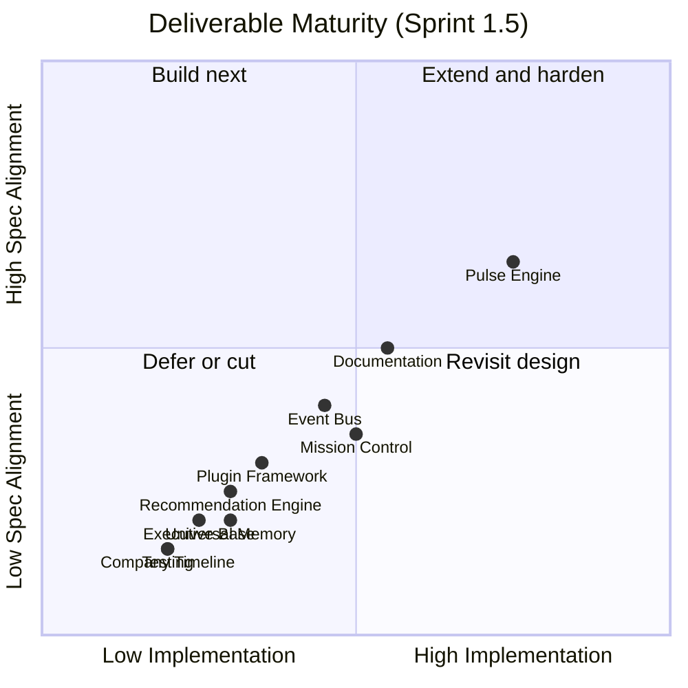
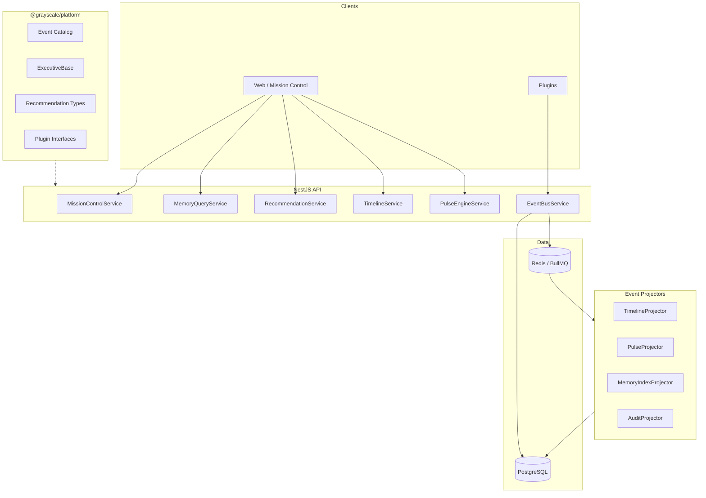
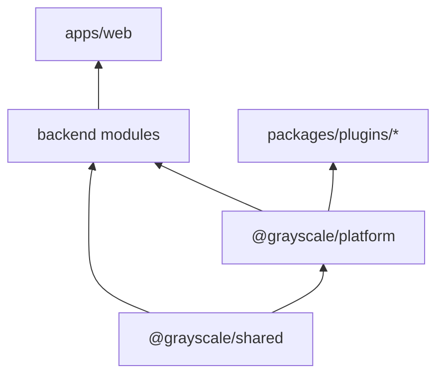

# Core Platform Design Review — Sprint 1.5

**Project:** Project Grayscale  
**Date:** 2026-07-25  
**Author:** Founding Principal Engineer / CTO  
**Status:** Review complete — awaiting approval before implementation  
**Prerequisite:** Sprint 1 Foundation complete (auth, migrations, guards, refresh tokens, initial pulse/plugins)

---

## Executive Summary

Project Grayscale is a **Company Operating System**, not an AI chatbot. Sprint 1.5 must build the **Core Platform** that every future executive inherits from — with zero duplicated logic, zero tight coupling, and no executive personalities yet.

**Current platform readiness:** ~35–42% toward Sprint 1.5 success criteria.

**Recommendation:** **Extend, don’t rewrite.** Sprint 1’s event → pulse → Mission Control spine is correct. Sprint 1.5 formalizes abstractions on top: **Event Store**, **Memory Index**, **Timeline Projector**, **ExecutiveBase**, **RecommendationFramework**, **Plugin Lifecycle**, and **Mission Control API**.

**Critical gate:** Freeze executive LLM execution until Deliverables 5–6 are structurally complete. Running Athena/Atlas today violates the sprint contract and creates coupling debt.

---

## Competitive Pillars (Every Decision Must Strengthen These)

| Pillar | Sprint 1.5 How |
|--------|----------------|
| Organizational Memory | Universal Memory Index + ingestion pipeline |
| Explainable Recommendations | Recommendation framework with evidence + audit trail |
| Event-Driven Architecture | Persistent event store + timeline/pulse projectors |
| Modular Executive Framework | ExecutiveBase abstract class — infrastructure only |
| Company Intelligence | Mission Control aggregation API |
| Founder Context | Memory relations + timeline linking |
| Local-first Privacy | Ollama routing preserved; no new cloud dependencies required |

---

## Current State vs Sprint 1.5 Spec



| # | Deliverable | Exists | Gap | Est. % |
|---|-------------|--------|-----|--------|
| 1 | Event Bus | BullMQ + typed events | History, replay, DLQ, versioning, audit | 40% |
| 2 | Universal Memory | Siloed CRUD tables | Unified index, search, relations | 25% |
| 3 | Mission Control | UI + pulse feed | Live aggregates for all panels | 45% |
| 4 | Plugin Framework | In-process hook registry | Install lifecycle, webhooks, packages | 30% |
| 5 | Executive Base | Minimal runtime + **live agent runs** | Abstract base, no LLM execution | 20% |
| 6 | Recommendation Engine | AgentRecommendation table | Evidence, audit, status machine | 25% |
| 7 | Company Timeline | Manual CRUD | Auto-ingestion from events | 15% |
| 8 | Pulse Engine | 7 heartbeats + health API | Multi-dimensional health | 60% |
| 9 | Documentation | ADRs + blueprint | Event catalog, ER, framework docs | 50% |
| 10 | Testing | 18 unit tests | 80% coverage on platform modules | 15% |

---

## Architecture Improvement Proposals

These challenge the sprint spec where a better approach exists. **Do not implement the spec blindly.**

### AIP-1: Memory Index Facade (not single-table rewrite)

**Spec says:** Everything becomes memory in one universal engine.

**Problem:** Replacing 10+ Prisma models with one polymorphic table in Sprint 1.5 is a high-risk migration with no user benefit yet.

**Proposal:** Introduce a **`MemoryRecord`** index table:

```
MemoryRecord {
  id, companyId, userId?, department?, memoryType, sourceTable, sourceId,
  title, summary?, tags[], metadata, occurredAt, createdAt
}
```

- Domain tables (`memories`, `bills`, `journal_entries`, etc.) remain source of truth.
- **MemoryIngestionService** writes index rows on create/update via events.
- **MemoryQueryService** provides unified search across index (full-text now; pgvector later).
- Existing APIs unchanged; new `/memory/unified` API for cross-type search.

**Why:** Delivers “nothing lost” and unified search without breaking Sprint 1 data. Executives query one interface.

**Trade-off:** Dual-write until all entity types emit ingestion events. Acceptable with event-driven projector.

---

### AIP-2: Postgres Event Store + BullMQ Transport (not Kafka)

**Spec implies:** Enterprise event bus with replay, DLQ, audit.

**Problem:** BullMQ alone drops history (`removeOnComplete: 100`).

**Proposal:** Two-layer bus:

| Layer | Technology | Responsibility |
|-------|------------|----------------|
| **Transport** | BullMQ (Redis) | Async delivery, retries, DLQ queue |
| **Store** | Postgres `domain_events` | Immutable log, replay, audit, correlation |

Flow: `publish()` → persist to `domain_events` → enqueue to BullMQ → processor → projectors (timeline, pulse, memory index).

**Why:** $0 incremental cost, one backup target, replay = `SELECT ... ORDER BY sequence`. ADR-001 still valid.

**Reject:** Kafka/Redpanda for Sprint 1.5 — ops cost and complexity unjustified below 100k events/day.

---

### AIP-3: Freeze Executive LLM Runs

**Spec says:** Build Executive Base framework only — no business logic, no personalities.

**Problem:** `AgentsService.runAgent()` already executes executives with LLM prompts.

**Proposal:**
1. Add `EXECUTIVES_ENABLED=false` (default in Sprint 1.5).
2. `runAgent()` returns `503 Feature not enabled` when false.
3. Build `ExecutiveBase` abstract class with lifecycle hooks — no LLM calls inside base.
4. Move runtime execution to Sprint 3 behind feature flag.

**Why:** Prevents architectural lie that “no executives exist” while code runs Athena.

---

### AIP-4: Recommendation as First-Class Entity (decouple from AgentRun)

**Spec:** Recommendation framework with evidence, audit, department, actions.

**Problem:** `AgentRecommendation` is tightly coupled to `AgentRun` and missing half the schema.

**Proposal:** New `Recommendation` model + `RecommendationAudit` table. `AgentRun` may *create* recommendations in Sprint 3, but framework accepts manual, rule-based, and integration-sourced recommendations now.

**Why:** Founders get recommendations before AI executives exist (e.g. “Bill due in 3 days” from billing projector).

---

### AIP-5: New `@grayscale/platform` Package

**Problem:** `@grayscale/shared` is types/constants; `@grayscale/agents` already implies execution.

**Proposal:**

```
packages/platform/
  src/
    events/       # Event catalog, versioning, envelope
    memory/       # MemoryRecord types, query interface
    executive/    # ExecutiveBase abstract class
    recommendation/
    plugin/       # Plugin manifest, lifecycle interfaces
    timeline/     # Timeline entry types
```

Backend implements interfaces; shared contracts stay versioned and testable without NestJS imports.

**Why:** Clean dependency graph: `shared` → `platform` → `backend` / `agents` (Sprint 3).

---

### AIP-6: Mission Control Backend API (eliminate static data)

**Problem:** `mission-control-data.ts` is a second source of truth.

**Proposal:** `GET /api/companies/:id/mission-control` aggregates:
- Pulse health (existing)
- Sprint metadata (DB or config file — not hardcoded TS)
- Open recommendations count
- Upcoming bills
- Integration statuses
- Recent timeline + events
- Test coverage (CI artifact or placeholder)
- Tech debt (from engineering journal parser or manual JSON)

UI becomes a pure renderer.

---

## Target Architecture (Sprint 1.5)



---

## Deliverable Designs

### 1. Event Bus

**Envelope (versioned):**

```typescript
interface PlatformEvent {
  id: string;
  type: string;           // e.g. "memory.updated"
  version: number;        // schema version per type
  companyId: string;
  userId?: string;
  payload: unknown;
  metadata: {
    correlationId: string;
    causationId?: string;
    traceId?: string;
    source: string;
    timestamp: string;
  };
}
```

**Event catalog** (expand from current ~20 to spec set):

| Category | Events |
|----------|--------|
| Project | `project.created`, `project.updated` |
| Task | `task.completed` |
| Billing | `bill.due`, `bill.paid` |
| Memory | `memory.updated`, `idea.captured` |
| Meeting | `meeting.scheduled` |
| Git | `git.commit.received` |
| Recommendation | `recommendation.generated` |
| Architecture | `architecture.decision.recorded` |
| Notification | `notification.sent` |
| Integration | `integration.connected` |
| Plugin | `plugin.installed` |
| Timeline | `timeline.updated` |
| Pulse | `pulse.updated` |
| Documentation | `documentation.generated` |

**Features:**

| Feature | Implementation |
|---------|----------------|
| Publish/Subscribe | BullMQ queues + `EventBusService.subscribe(type, handler)` registry |
| Event history | `domain_events` table with monotonic `sequence` per company |
| Replay | `EventBusService.replay(fromSequence, toSequence, handlers)` |
| Retry | BullMQ attempts (3) with exponential backoff |
| DLQ | Queue `domain-events-dlq` + `domain_event_failures` table |
| Audit | All events persisted; `audit_log` for sensitive actions |
| Tracing | `traceId` in metadata; optional OpenTelemetry in Sprint 2 |

**Migration path:** Wrap existing `EventsService.publish()` to persist before enqueue.

---

### 2. Universal Memory Engine

**Memory types (enum):** `project`, `task`, `meeting`, `bill`, `note`, `idea`, `bookmark`, `recommendation`, `approval`, `adr`, `git_activity`, `integration`, `notification`, `journal`, `document`, `timeline`

**Required fields on every MemoryRecord:** companyId, userId?, department?, source, memoryType, title, occurredAt, tags[], metadata, relatedIds[]

**APIs:**
- `POST /memory/ingest` — internal/projector use
- `GET /memory/search?q=&type=&tags=` — unified search
- `GET /memory/:id` — resolve to source entity

**Semantic search (future-ready):** Add nullable `embedding vector(1536)` column on `memory_records`; populate in Sprint 2.

---

### 3. Mission Control

**Panels → data source:**

| Panel | Source |
|-------|--------|
| Current Sprint | `sprint_config` or engineering journal |
| Sprint Progress | Task events / manual |
| Architecture Health | ADR count, pulse category |
| Repository Status | GitHub plugin (future) / placeholder |
| Documentation Progress | File count or journal |
| Code Coverage | CI artifact JSON |
| Technical Debt | Engineering journal |
| Open Recommendations | `Recommendation` where status=open |
| Upcoming Bills | `Bill` query |
| Integrations | `Integration` table |
| Recent Events | `domain_events` last 24h |
| Company Timeline | `TimelineEvent` |
| Pulse Score | PulseEngine health |
| Build Health | CI webhook (future) |

---

### 4. Plugin Framework

**Plugin manifest:**

```typescript
interface PluginManifest {
  id: string;
  name: string;
  version: string;
  auth: "oauth" | "api_key" | "none";
  events: string[];      // emits
  subscriptions: string[]; // listens
  actions: PluginAction[];
  webhooks?: WebhookConfig;
  permissions: string[];
}
```

**Lifecycle:** `install` → `configure` → `sync` → `healthCheck` → `uninstall`

**Storage:** `installed_plugins` table per company.

**First plugin:** Extract GitHub sync from `MemoryService` into `packages/plugins/github`.

**Rule:** Plugins register via `PluginsService.register(manifest, module)` — never import core services from plugins.

---

### 5. Executive Base Framework

**Abstract class (no LLM, no personality):**

```typescript
abstract class ExecutiveBase {
  abstract readonly identity: ExecutiveIdentity;
  abstract readonly permissions: PermissionScope;

  constructor(
    protected memory: MemoryQueryPort,
    protected events: EventBusPort,
    protected recommendations: RecommendationPort,
  ) {}

  abstract onEvent(event: PlatformEvent): Promise<void>;
  abstract health(): Promise<ExecutiveHealth>;

  protected propose(recommendation: CreateRecommendationInput): Promise<Recommendation>;
  protected emit(event: PlatformEvent): Promise<void>;
  protected audit(entry: AuditEntry): Promise<void>;
}
```

**Sprint 1.5 delivers:** Interface + abstract class + ports + mock executive for tests. **No concrete executives.**

---

### 6. Recommendation Engine

**Schema:**

```
Recommendation {
  id, companyId, title, summary, reasoning, evidence[], confidence,
  estimatedRoi, priority, department, relatedMemoryIds[], suggestedActions[],
  requiresApproval, status, createdBy, createdAt
}
RecommendationAudit { id, recommendationId, action, actorId, timestamp, metadata }
```

**Statuses:** `draft` → `pending_approval` → `approved` | `rejected` | `amended`

**Sources:** `system`, `plugin`, `executive` (Sprint 3), `founder`

**Rule:** Every recommendation must be explainable (NON_NEGOTIABLES #3).

---

### 7. Company Timeline

**TimelineProjector** subscribes to all domain events and creates `TimelineEvent` rows:

```
TimelineEvent {
  ...existing fields,
  sourceEventId,    // link to domain_events.id
  sourceType,       // memory | bill | git | ...
  sourceId,
}
```

**Unified API:** `GET /timeline?from=&to=&types=` — chronological, filterable.

---

### 8. Pulse Engine (extend)

**Health dimensions:**

| Dimension | Signal |
|-----------|--------|
| Platform | Event processing latency, DLQ depth |
| Repository | Git plugin sync recency |
| Documentation | ADR + README count delta |
| Testing | Coverage % from CI |
| Integration | Connected vs failed count |
| Security | Open critical recommendations |
| Billing | Overdue bill count |

**Mission Control** subscribes via existing `/pulse/health` + new dimension breakdown.

---

## Dependency Graph



**Build order (implementation phases):**

| Phase | Deliverables | Duration est. |
|-------|--------------|---------------|
| **1.5a** | Event store + catalog + DLQ + projectors skeleton | 3–4 days |
| **1.5b** | Memory index + ingestion + unified search | 3–4 days |
| **1.5c** | Timeline projector + Recommendation framework | 3 days |
| **1.5d** | ExecutiveBase + freeze agent runs | 2 days |
| **1.5e** | Plugin lifecycle + GitHub plugin extract | 3 days |
| **1.5f** | Mission Control API + UI wiring | 3 days |
| **1.5g** | Pulse dimensions + documentation + tests to 80% | 4 days |

**Total:** ~2.5–3 weeks (aligned with Sprint 1.5 window).

---

## Risks and Mitigations

| Risk | Severity | Mitigation |
|------|----------|------------|
| Big-bang memory migration | High | Memory Index facade (AIP-1) |
| Event store growth | Medium | Partition by month; retention policy (90d hot, archive cold) |
| Plugin security | High | Sandboxed permissions; encrypted tokens (Sprint 1.5) |
| Scope creep into executives | High | Feature flag + code freeze on `runAgent` |
| Test coverage 80% | Medium | Test per module as built; vitest coverage gates in CI |
| Dual-write inconsistency | Medium | Projectors idempotent; event sourcing as source of truth |
| Horizontal scaling SSE pulse | Low | Abstract `PulseStreamPort`; Redis pub/sub in Sprint 2 |

---

## Trade-offs Accepted

| Decision | Accepted trade-off | Revisit when |
|----------|-------------------|--------------|
| Postgres event store vs Kafka | Lower throughput ceiling | >100k events/day |
| Memory index vs single table | Dual-write complexity | Proven search needs simplify schema |
| In-process plugins vs WASM/isolated | Same-process trust | Untrusted third-party plugins |
| localStorage tokens | XSS risk | httpOnly cookies Sprint 2 |
| Polling Mission Control | Not real-time | SSE/WebSocket after pulse Redis pub/sub |

---

## Scalability Expectations

| Scale | Architecture holds? |
|-------|---------------------|
| 1 company, 1 founder | Yes — current stack |
| 1k companies | Yes — Postgres indexes, BullMQ workers |
| 10k companies | Yes with read replicas + worker scaling |
| 1M events/day | Needs Kafka or partitioned event store |
| 10M memory records | Needs pgvector indexes + archival |

**Target for Sprint 1.5:** Architect for **1k companies / 100k events/day** without rework.

---

## Testing Strategy (Deliverable 10)

| Module | Unit | Integration |
|--------|------|-------------|
| EventBusService | publish, replay, DLQ | Postgres + Redis testcontainers |
| MemoryIndexProjector | mapping | event → memory record |
| TimelineProjector | event → timeline | e2e flow |
| RecommendationService | CRUD, audit, status | approval workflow |
| ExecutiveBase | mock subclass | port mocks |
| PulseEngine | dimension scoring | health aggregation |
| CompanyMemberGuard | existing | — |
| MissionControlService | aggregation | API supertest |

**CI gate:** `vitest --coverage` ≥ 80% on `packages/platform` + new backend modules.

---

## Documentation Deliverables (Deliverable 9)

| Document | Path |
|----------|------|
| This review | `docs/architecture/CORE_PLATFORM_DESIGN_REVIEW.md` |
| Event catalog | `docs/platform/EVENT_CATALOG.md` |
| Data model ER | `docs/platform/DATA_MODEL.md` |
| Executive framework | `docs/platform/EXECUTIVE_BASE.md` |
| Plugin spec | `docs/platform/PLUGIN_SPEC.md` |
| Recommendation spec | `docs/platform/RECOMMENDATION_ENGINE.md` |
| ADR-006 Event store | `docs/architecture/ADR-006-event-store.md` |
| ADR-007 Memory index | `docs/architecture/ADR-007-memory-index.md` |
| Module READMEs | Each new backend module |

---

## Success Criteria Checklist

Sprint 1.5 is complete when:

- [ ] Event Bus operational (store + DLQ + replay + catalog)
- [ ] Universal Memory Engine operational (index + search + ingestion)
- [ ] Mission Control dashboard operational (API-driven, all panels live or honestly empty)
- [ ] Plugin framework operational (lifecycle + GitHub plugin)
- [ ] Executive Base Framework complete (abstract class, no LLM runs)
- [ ] Recommendation Framework complete (full schema + audit)
- [ ] Company Timeline operational (auto-ingestion via projector)
- [ ] Pulse Engine operational (multi-dimensional health)
- [ ] Documentation generated (catalog, ER, framework docs)
- [ ] Tests passing (80%+ on new platform code)
- [ ] **Zero executive agents executing** (`EXECUTIVES_ENABLED=false`)

---

## Decision Required

**Approve this design to begin Sprint 1.5 implementation Phase 1.5a (Event Store + Catalog).**

If you want adjustments before code:
1. Memory Index vs single-table — confirm AIP-1
2. Freeze agent runs — confirm AIP-3
3. New `@grayscale/platform` package — confirm AIP-5
4. Phase ordering — any reprioritization?

---

**Related:** [ARCHITECTURE_REVIEW.md](./ARCHITECTURE_REVIEW.md) · [ADR-005](./ADR-005-pulse-engine-and-plugins.md) · [NON_NEGOTIABLES.md](../NON_NEGOTIABLES.md) · [SPRINT_1_FOUNDATION.md](../engineering/SPRINT_1_FOUNDATION.md)
