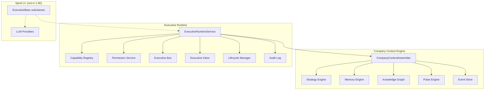
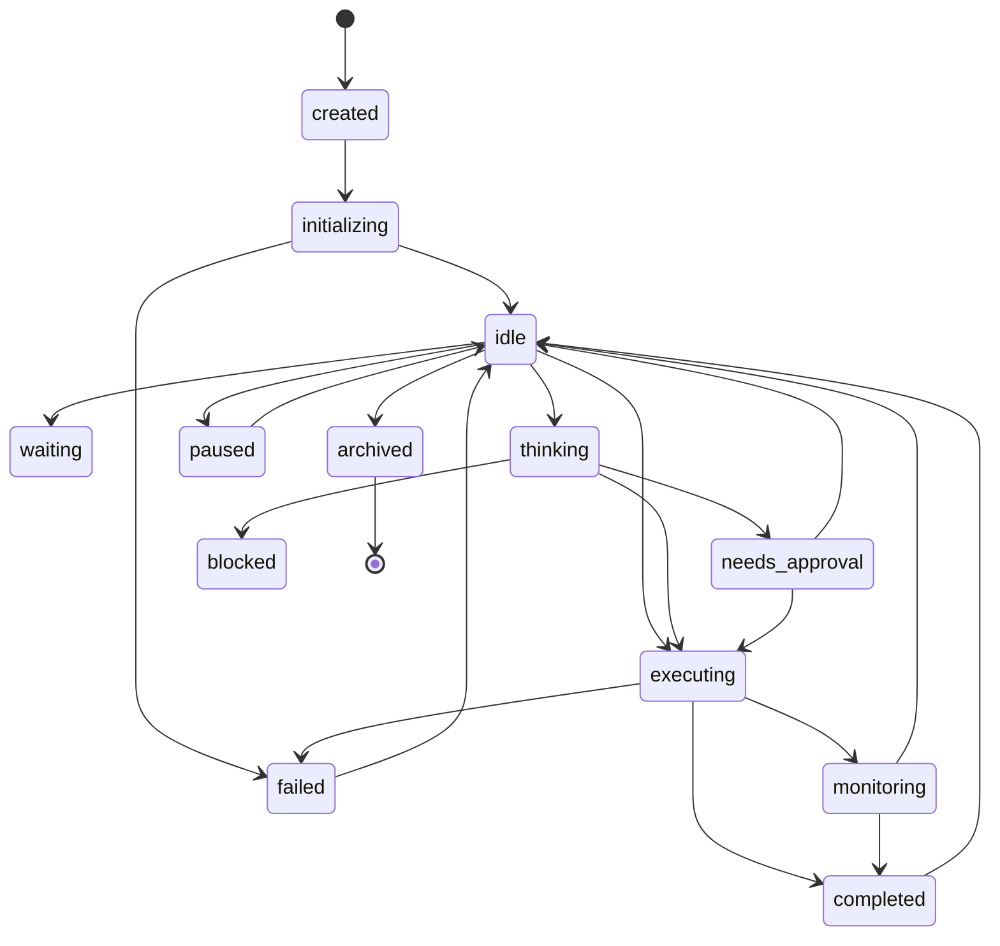
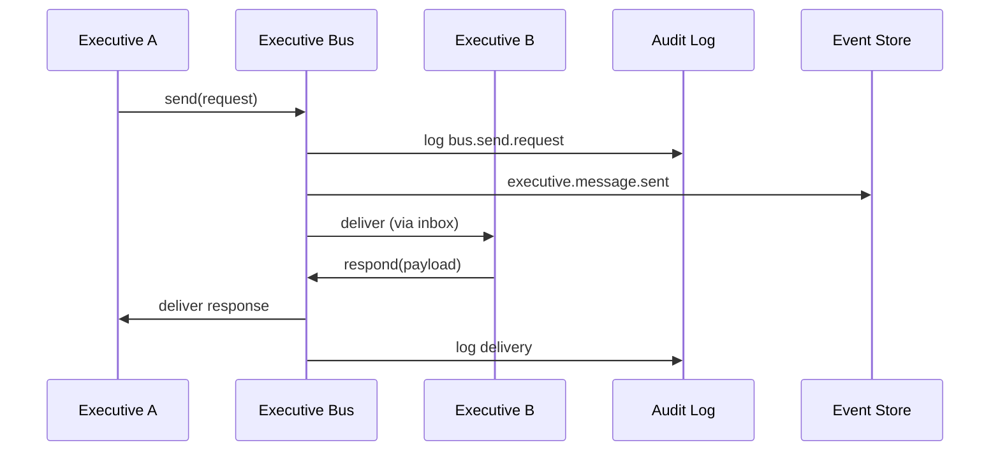
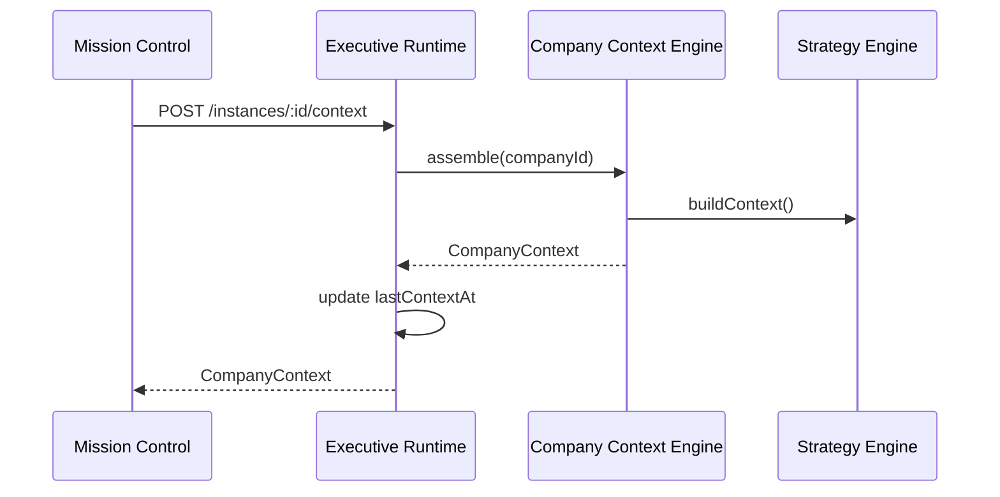

# Executive Runtime Architecture

Phase 1.5E — infrastructure for hosting future executives as OS processes.

## Design Principles

| Principle | Implementation |
|-----------|----------------|
| No direct service access | Executives receive `CompanyContext` only |
| No executive-to-executive calls | `ExecutiveBus` with correlation/trace IDs |
| No LLM in runtime | `EXECUTIVES_ENABLED=false` default |
| No personalities | `ExecutiveIdentity` is metadata only |
| Full explainability | `ExecutiveExplainability` schema on every output |

---

## Component Overview



---

## Company Context Engine

`CompanyContext` aggregates:

- Company profile, founder profile, operating mode
- Goals, objectives, projects, tasks
- Timeline, memory, knowledge graph, strategy context
- Recommendations, decisions, risks, opportunities
- Bills, cash position
- Pulse, mission status, plugin status
- Infrastructure, security, integrations
- Recent domain events

**Rule:** Executives must never query individual services.

---

## Executive Lifecycle



---

## Executive Communication Bus



Message types: `request`, `response`, `notification`, `escalation`, `delegation`, `broadcast`.

Features: correlation IDs, trace IDs, timeout, retry, audit trails.

---

## Context Injection Sequence



---

## Capability & Permission Model

**Capabilities** declare what an executive can do:
- `ReadMemory`, `ReadGraph`, `ReadStrategy`, `CreateRecommendation`, etc.

**Permissions** declare authorization independently:
- `read`, `write`, `approve`, `reject`, `execute`, `escalate`, `notify`, `delegate`

Execution requests check permissions before queuing to inbox.

---

## Explainability Schema

Every `ExecutiveOutput` includes:

| Field | Purpose |
|-------|---------|
| `reason` | Why this output exists |
| `evidence` | Memory, event, graph references |
| `confidence` + `confidenceSources` | Explainable confidence |
| `risk` | Risk level and summary |
| `dependencies` | Blocking dependencies |
| `alternatives` | Options considered |
| `policyUsed` / `constraintsUsed` | Governance applied |
| `decisionPath` | Step-by-step reasoning chain |

---

## Execution Policy

```
EXECUTIVES_ENABLED=false  (default)
```

- Runtime infrastructure is fully active
- Context assembly, inbox, bus, lifecycle all work
- `AgentsService.runAgent()` returns 503
- Sprint 2 enables execution after runtime validation

---

## Database Tables

| Table | Purpose |
|-------|---------|
| `executive_instances` | Runtime state per company/executive slot |
| `executive_messages` | Bus messages |
| `executive_inbox_items` | Queue items |
| `executive_audit_logs` | Audit trail |
| `executive_outputs` | Structured outputs with explainability |

---

## Platform Package

Contracts live in `packages/platform/src/executive/`:

- `context.ts` — `CompanyContext`, `CompanyContextAssemblerPort`
- `runtime.ts` — `ExecutiveRuntimePort`, `ExecutiveInstance`
- `capabilities.ts` — capability registry
- `permissions.ts` — permission framework
- `bus.ts` — communication bus
- `inbox.ts` — inbox queues
- `lifecycle.ts` — state machine
- `explainability.ts` — output schema
- `ports.ts` — `ExecutiveBase` abstract class

---

## Future: Sprint 2

Concrete executives extend `ExecutiveBase`:

```typescript
class AthenaExecutive extends ExecutiveBase {
  readonly identity = EXECUTIVES.athena;
  readonly capabilities = ["ReadStrategy", "CreateRecommendation"];

  async onContext(ctx: CompanyContext): Promise<void> { /* Sprint 2 */ }
  async onEvent(event: PlatformEvent): Promise<void> { /* Sprint 2 */ }
  async health(): Promise<ExecutiveHealth> { /* Sprint 2 */ }
  async onLifecycleChange(from, to): Promise<void> { /* Sprint 2 */ }
}
```

No architectural changes required — only implementations.
