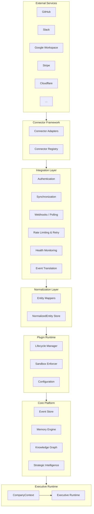
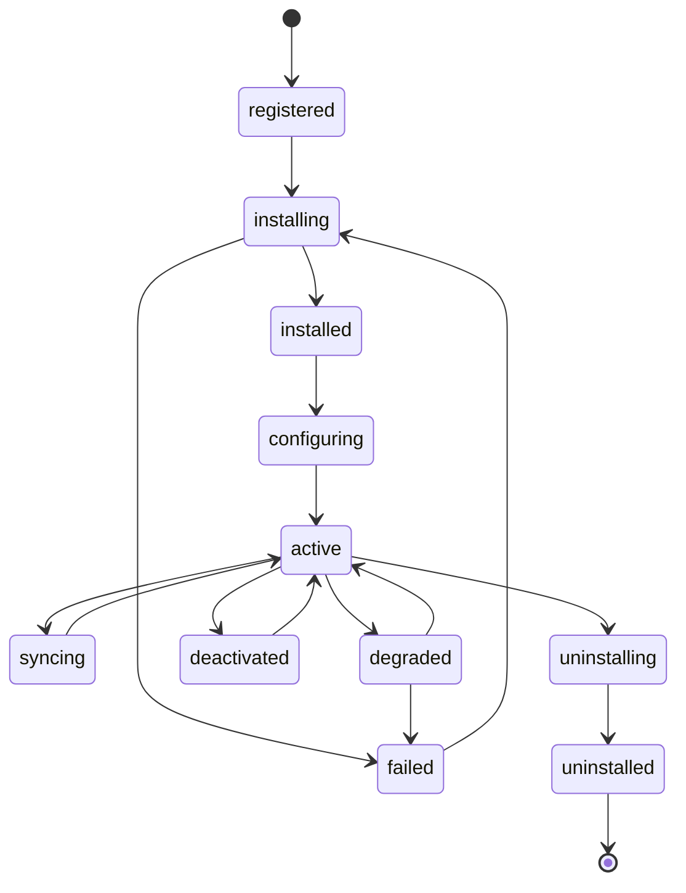
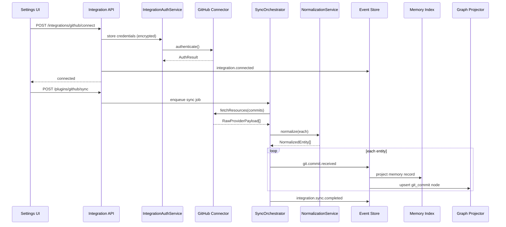
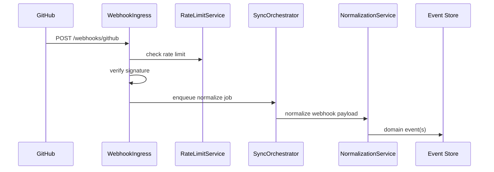
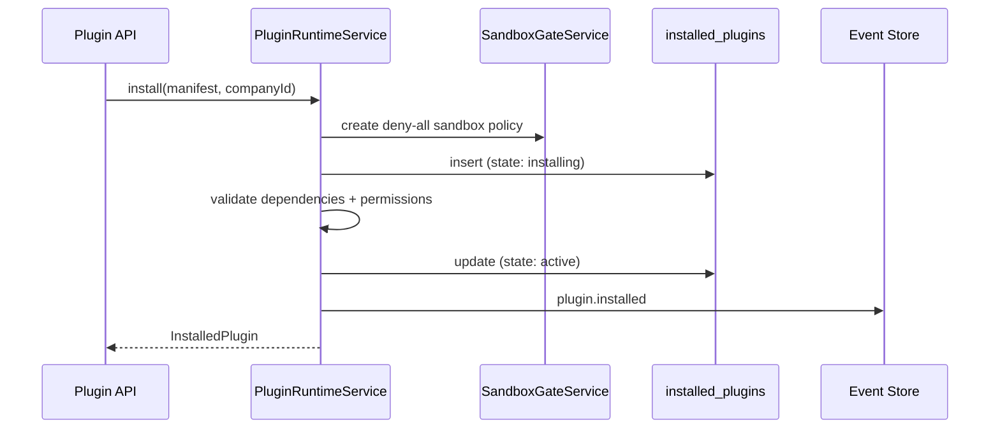

# Integration & Plugin Platform — Design Review (Phase 1.5F)

**Project:** Project Grayscale  
**Date:** 2026-07-25  
**Author:** Founding Principal Engineer / CTO  
**Status:** Approved — **implemented** (Phase 1.5F complete)  
**Prerequisites:** Phase 1.5A (Event Store) ✅ · 1.5B (Memory Engine) ✅ · 1.5C (Knowledge Graph) ✅ · 1.5D (Strategic Intelligence) ✅ · 1.5E (Executive Runtime) ✅ — **Approved**

---

## Executive Summary

Phase 1.5F builds the **Integration & Plugin Platform** — the connective tissue between Project Grayscale and the external world.

**Core thesis:** Project Grayscale owns the platform. External providers are replaceable. Executives never communicate directly with external services. Every external system communicates through the Integration Layer, normalizes into platform entities, and surfaces in `CompanyContext` only after normalization.

**Recommendation:** Implement a **seven-layer architecture** (External Services → Connector Framework → Integration Layer → Normalization Layer → Plugin Runtime → Core Platform → Executive Runtime) with provider-agnostic ports in `@grayscale/platform`, backend orchestration services, a Plugin SDK, sandbox enforcement, and marketplace foundation (architecture only). Extract GitHub as the **reference production plugin**.

**Scale target:** Hundreds of connectors, thousands of company-scoped plugin installs, millions of normalized entities per day, sub-500ms health check aggregation per company.

**Out of scope for 1.5F:** Marketplace UI, third-party untrusted plugin hosting (WASM/isolated VM), full implementations of all listed providers (interfaces + GitHub reference only).

---

## Updated Foundation Roadmap

```
Phase 1.5F  Integration & Plugin Platform     ← THIS REVIEW
     ↓
Phase 1.5G  Mission Control Live
     ↓
Phase 1.5H  Observability, Pulse Enhancement, Platform Hardening & Production Readiness
     ↓
FOUNDATION COMPLETE → Sprint 2 (Executive Systems)
```

Sprint 2 (Athena, Atlas, Ledger, etc.) begins **only after Foundation is complete**.

---

## Platform Layer Model



| Layer | Single Responsibility | Does NOT |
|-------|----------------------|----------|
| Connector Framework | Provider-specific API/protocol adapters | Business logic, persistence |
| Integration Layer | Auth, sync, webhooks, rate limits, health | Normalize entities |
| Normalization Layer | Map provider data → platform entities | Call external APIs |
| Plugin Runtime | Install, configure, sandbox, lifecycle | Store raw provider payloads |
| Core Platform | Events, memory, graph, strategy | Know provider specifics |
| Executive Runtime | Context injection to executives | Direct external calls |

**Invariant:** Data flows **up** through layers; commands flow **down** through sandboxed APIs only.

---

## Current State Assessment

| Component | Maturity | Location |
|-----------|----------|----------|
| Hook registry | ~30% | `PluginsService`, `PLUGIN_HOOKS` (2/7 hooks dispatched) |
| Integration CRUD | ~20% | `Integration` model, GitHub connect only |
| GitHub sync | Ad-hoc | Embedded in `MemoryService.syncFromGitHub` |
| Event catalog | Defined | `integration.*`, `plugin.*` events (partially published) |
| Graph types | Ready | `integration`, `plugin`, `git_commit` node types |
| Memory types | Ready | `integration`, `git_activity` memory types |
| Platform plugin ports | **Missing** | `packages/platform/src/plugin/` does not exist |
| Connector abstraction | **Missing** | No `ConnectorPort` |
| Plugin SDK | **Missing** | Manifest v1 only in shared |
| Sandbox | **Missing** | No permission enforcement |
| Marketplace | **Missing** | Architecture only in this review |

---

## Core Components

### 1. Connector Framework

Provider adapters implement `ConnectorPort` — isolated, replaceable, testable.

```typescript
interface ConnectorPort {
  readonly providerId: string;
  readonly version: string;
  readonly supportedAuth: AuthMethod[];

  authenticate(credentials: ConnectorCredentials): Promise<AuthResult>;
  refreshAuth(refreshToken: string): Promise<AuthResult>;
  healthCheck(connection: ConnectionContext): Promise<ConnectorHealth>;
  fetchResources(ctx: ConnectionContext, query: FetchQuery): Promise<RawProviderPayload[]>;
  handleWebhook(ctx: ConnectionContext, payload: unknown): Promise<RawProviderPayload[]>;
}
```

**Phase 1.5F deliverables:**

| Provider | 1.5F Scope |
|----------|------------|
| GitHub | Full reference implementation |
| GitLab, Cursor, Replit, Figma, Canva | Interface + stub adapter |
| Google Workspace, Microsoft 365, Apple Calendar/Notes | Interface + stub adapter |
| Slack, Discord | Interface + stub adapter |
| Stripe, Vultr, Cloudflare | Interface + stub adapter |
| AskTrabaajo, Tau Core, Dot Protocol | Interface + stub adapter (first-party reserved) |

Connectors live in `packages/connectors/{provider}/` — never imported by core modules directly.

See [CONNECTOR_SPECIFICATION.md](../platform/CONNECTOR_SPECIFICATION.md).

---

### 2. Integration Layer

Orchestrates external communication without business logic.

| Responsibility | Service |
|----------------|---------|
| Authentication | `IntegrationAuthService` — OAuth, API key, token refresh |
| Synchronization | `SyncOrchestratorService` — BullMQ scheduled + manual sync |
| Webhooks | `WebhookIngressService` — verify signature, enqueue normalize job |
| Polling | `PollingSchedulerService` — configurable intervals per connector |
| Rate Limiting | `RateLimitService` — per-provider token bucket |
| Retry Policies | Exponential backoff, dead-letter queue |
| Error Handling | Structured `IntegrationError` → events + pulse |
| Health Monitoring | `IntegrationHealthService` — aggregate connector status |
| Event Translation | Raw provider events → platform event catalog types |

**Rules:**
- No business logic — only transport, auth, scheduling, and error translation
- Every sync is idempotent (idempotency key = `{companyId}:{provider}:{resourceId}:{version}`)
- Failed syncs publish `integration.sync.failed` + pulse heartbeat
- Successful syncs publish `integration.sync.completed`

---

### 3. Normalization Layer

Converts provider-specific data into **platform entities**.

```typescript
type NormalizedEntityType =
  | "task"           // GitHub PR, GitLab MR, Jira issue
  | "meeting"        // Google/Apple/Outlook calendar event
  | "development_activity"  // Cursor/Replit activity
  | "bill"           // Stripe/Vultr invoice
  | "message"        // Slack/Discord message
  | "design_asset"   // Figma/Canva asset
  | "document"       // Google Docs, M365 file
  | "notification"   // Provider-native alert
  | "metric";        // Cloudflare/Vultr telemetry

interface NormalizedEntity {
  id: string;                    // platform-assigned UUID
  companyId: string;
  entityType: NormalizedEntityType;
  sourceProvider: string;
  sourceId: string;              // provider-native ID
  sourceUrl?: string;
  displayName: string;
  summary?: string;
  occurredAt: string;
  metadata: Record<string, unknown>;
  rawPayloadHash: string;        // dedup / audit
}
```

**Example mappings:**

| Provider Object | Platform Entity |
|-----------------|-----------------|
| GitHub Pull Request | `task` |
| Google Calendar Event | `meeting` |
| Cursor Activity | `development_activity` |
| Vultr Invoice | `bill` |
| Slack Message | `message` |
| Figma Frame | `design_asset` |
| Stripe Invoice | `bill` |

**Post-normalization pipeline:**

```
NormalizedEntity
  → domain event (e.g. git.commit.received, meeting.scheduled)
  → Memory Index Projector
  → Graph Projector (typed node + CONNECTED_TO edges)
  → Optional SIF rule evaluation
```

Executives consume normalized data **only via `CompanyContext`** — never raw provider payloads.

---

### 4. Plugin Runtime

Full lifecycle management per company.



| Capability | Description |
|------------|-------------|
| Installation | Register manifest, create `installed_plugins` row |
| Activation | Enable hooks, start sync schedule |
| Deactivation | Pause sync, disable hooks |
| Versioning | Semver compatibility checks |
| Configuration | JSON Schema-validated settings per plugin |
| Permissions | Declared + granted permission strings |
| Capability Declaration | Maps to executive capability namespace |
| Health | Periodic `healthCheck()` + last sync status |
| Lifecycle | State machine above |
| Dependencies | Requires other plugins/integrations |
| Events | Publish/subscribe via event catalog |
| Commands | Invokable actions (e.g. `github.sync-now`) |
| UI Extensions | Manifest declares Mission Control panel slots (1.5G consumes) |

**Storage:** `installed_plugins`, `plugin_sync_jobs`, `plugin_health_snapshots`, `integration_credentials` (encrypted).

---

### 5. Plugin SDK

Reusable SDK for first-party and future third-party developers.

Package: `@grayscale/plugin-sdk`

```typescript
interface PluginManifestV2 {
  id: string;
  name: string;
  version: string;
  minPlatformVersion: string;
  description?: string;
  author?: string;
  category: PluginCategory;
  auth: PluginAuthConfig;
  permissions: PluginPermission[];
  capabilities: string[];
  hooks: PluginHook[];
  commands: PluginCommand[];
  events: PluginEventDeclaration[];
  subscriptions: PlatformEventType[];
  settings: JSONSchema;
  dependencies?: PluginDependency[];
  uiExtensions?: UIExtensionSlot[];
  localization?: Record<string, Record<string, string>>;
}
```

See [PLUGIN_SDK_SPECIFICATION.md](../platform/PLUGIN_SDK_SPECIFICATION.md).

---

### 6. Plugin Sandbox

Every plugin operates inside a sandbox with explicit grants.

```typescript
interface PluginSandboxPolicy {
  pluginId: string;
  allowedApis: SandboxApi[];       // memory.read, graph.read, events.publish, etc.
  allowedEvents: PlatformEventType[];
  allowedExecutives: string[];     // executive IDs or "*"
  allowedStorage: StorageQuota;    // max bytes, TTL
  allowedPermissions: string[];
  networkPolicy: "none" | "provider_only" | "allowlist";
  networkAllowlist?: string[];
}
```

**Enforcement:**
- `SandboxGateService` intercepts all plugin API calls
- Violations → audit log + plugin degraded state + pulse alert
- No plugin receives unrestricted platform access
- Connectors run outside sandbox (Integration Layer) — plugins invoke connectors via Integration Layer APIs only

See [PLUGIN_SECURITY_MODEL.md](./PLUGIN_SECURITY_MODEL.md) and [PLUGIN_SANDBOX_MODEL.md](./PLUGIN_SANDBOX_MODEL.md).

---

### 7. Marketplace Foundation (Architecture Only)

No UI in 1.5F. Design for future marketplace.

| Concept | Schema / Interface |
|---------|-------------------|
| Plugin Metadata | `marketplace_plugins` (id, name, author, category, description) |
| Publishing | Signed manifest upload → verification pipeline |
| Signing | Ed25519 publisher keys |
| Version Management | Semver + `minPlatformVersion` compatibility matrix |
| Compatibility | Platform version ↔ plugin version matrix |
| Reviews | `marketplace_reviews` (future) |
| Categories | productivity, development, finance, communication, design |
| Licensing | `license` field on manifest (MIT, proprietary, etc.) |
| Verification | First-party badge, verified publisher, community |

See [MARKETPLACE_ARCHITECTURE.md](./MARKETPLACE_ARCHITECTURE.md).

---

## Architecture Decision Proposals

| ID | Decision | Recommendation |
|----|----------|----------------|
| **AIP-14** | Connector isolation | All provider code in `packages/connectors/*`; core imports ports only |
| **AIP-15** | Normalization before persistence | Never store raw provider payloads in core tables; hash + optional audit blob |
| **AIP-16** | Plugin manifest v2 | Extend shared manifest with auth, permissions, commands, settings schema |
| **AIP-17** | Credential encryption | AES-256-GCM at rest; never return tokens in API responses |
| **AIP-18** | Sync via BullMQ | All sync/webhook normalize jobs async; inline sync deprecated |
| **AIP-19** | Sandbox by default | Deny-all policy; explicit grants per plugin |
| **AIP-20** | GitHub as reference plugin | Extract from MemoryService; acceptance gate for 1.5F completion |
| **AIP-21** | Executive isolation | Executives consume normalized entities via CompanyContext only |
| **AIP-22** | Event deduplication | Idempotency keys on all integration events |

---

## Sequence Diagrams

### Connect & Sync Flow



### Webhook Ingress



### Plugin Install Lifecycle



---

## Mission Control Integration APIs (1.5F)

Reusable APIs — no dashboard implementation (1.5G).

Base path: `/companies/:companyId/platform`

| Endpoint | Description |
|----------|-------------|
| `GET /plugins/health` | All installed plugin health summaries |
| `GET /integrations/health` | Connector + auth + sync health |
| `GET /integrations/:provider/sync-status` | Last sync, next scheduled, error count |
| `GET /connectors/status` | Registered connectors + version |
| `GET /webhooks/status` | Webhook endpoint health per provider |
| `GET /integrations/:provider/auth-status` | Token expiry, refresh status |

These feed Phase 1.5G Mission Control Live panels.

---

## Data Model (Proposed)

```prisma
model InstalledPlugin {
  id            String   @id @default(uuid())
  companyId     String
  pluginId      String
  version       String
  state         String   // registered | installing | active | ...
  config        Json     @default("{}")
  permissions   Json     @default("[]")
  sandboxPolicy Json
  installedAt   DateTime
  updatedAt     DateTime
  @@unique([companyId, pluginId])
}

model IntegrationCredential {
  id              String   @id @default(uuid())
  companyId       String
  provider        String
  encryptedSecret String   // AES-256-GCM blob
  expiresAt       DateTime?
  refreshToken    String?  // encrypted
  metadata        Json
  @@unique([companyId, provider])
}

model PluginSyncJob {
  id          String   @id @default(uuid())
  companyId   String
  pluginId    String
  status      String
  startedAt   DateTime?
  completedAt DateTime?
  error       String?
  stats       Json     // items fetched, normalized, skipped
}

model NormalizedEntityRecord {
  id              String   @id @default(uuid())
  companyId       String
  entityType      String
  sourceProvider  String
  sourceId        String
  payloadHash     String
  memoryRecordId  String?
  graphNodeId     String?
  occurredAt      DateTime
  @@unique([companyId, sourceProvider, sourceId, payloadHash])
}
```

`Integration` table evolves — credentials migrate to `IntegrationCredential`; `Integration` becomes connection metadata + health.

---

## GitHub Reference Plugin — Acceptance Criteria

1. Lives in `packages/connectors/github` + `packages/plugins/github`
2. Connect publishes `integration.connected` + graph `integration` node
3. Sync publishes `git.commit.received` (not only `memory.created`) + memory index + graph `git_commit`
4. Disconnect publishes teardown event + removes credentials
5. `ON_INTEGRATION_SYNC` hook dispatched
6. Health endpoint returns last sync + error state
7. MemoryService GitHub logic removed (deprecated path with migration note)
8. 80%+ test coverage on plugin + connector modules

---

## Migration Plan

| Step | Action | Risk |
|------|--------|------|
| 1 | Add platform plugin/connector ports | None — additive |
| 2 | Add Prisma migrations | Low — new tables |
| 3 | Build Integration Layer services | Low |
| 4 | Extract GitHub connector from MemoryService | Medium — preserve UI contract |
| 5 | Wire graph/memory projectors for integration events | Low |
| 6 | Encrypt existing plaintext tokens | Medium — migration script |
| 7 | Deprecate `POST /memory/sync/github` → plugin command | Low — alias period |

---

## Engineering Gates (1.5F)

| Gate | Rule |
|------|------|
| ❌ No executive implementations | EXECUTIVES_ENABLED remains false |
| ❌ No Marketplace UI | Architecture only |
| ❌ No untrusted third-party plugin execution | Same-process first-party only |
| ❌ No business logic in Integration Layer | Transport + auth + scheduling only |
| ❌ Executives never call external APIs | CompanyContext only |
| ✅ GitHub reference plugin complete |
| ✅ Sandbox enforced for all plugin API calls |
| ✅ Credentials encrypted at rest |
| ✅ 80%+ test coverage |
| ✅ ADR-011 Accepted |

---

## Test Strategy

| Module | Unit | Integration |
|--------|------|-------------|
| ConnectorPort + GitHub adapter | Mock HTTP | GitHub API fixture |
| Normalization mappers | Pure functions | End-to-end sync |
| Plugin lifecycle | State machine | Install → sync → uninstall |
| Sandbox gate | Permission matrix | Violation → audit |
| Sync orchestrator | Job enqueue | BullMQ worker |
| Health aggregation | Mock connectors | Multi-plugin company |
| Credential encryption | Round-trip | Migration from plaintext |

---

## Implementation Phases (Post-Approval)

| Sub-phase | Deliverable | Est. |
|-----------|-------------|------|
| **1.5F-a** | Platform ports + manifest v2 + ADR-011 | 2 days |
| **1.5F-b** | Prisma schema + credential encryption | 1 day |
| **1.5F-c** | Integration Layer services | 3 days |
| **1.5F-d** | Normalization Layer + entity mappers | 2 days |
| **1.5F-e** | Plugin Runtime + sandbox | 3 days |
| **1.5F-f** | GitHub connector + plugin extract | 3 days |
| **1.5F-g** | Graph/memory projector wiring | 2 days |
| **1.5F-h** | Health APIs + stub connectors | 2 days |
| **1.5F-i** | Plugin SDK package + docs | 2 days |
| **1.5F-j** | Tests + marketplace schema (no UI) | 2 days |

**Total estimate:** ~22 engineering days

---

## Open Questions for Review

1. **OAuth proxy:** Central OAuth callback URL vs per-connector — recommend central `/oauth/callback/:provider`
2. **Raw payload retention:** Store encrypted audit blob vs hash-only — recommend 30-day encrypted audit blob
3. **Plugin isolation upgrade path:** Document WASM/worker migration in ADR but defer to post-Foundation
4. **AskTrabaajo/Tau Core/Dot Protocol:** First-party connectors with elevated sandbox — confirm in review

---

## Approval Checklist

- [x] Layer model approved (7 layers, single responsibility)
- [x] AIP-14 through AIP-25 accepted or amended
- [x] GitHub reference plugin scope confirmed
- [x] Marketplace foundation (architecture only) confirmed
- [x] Mission Control API surface confirmed (no UI in 1.5F)
- [x] Credential encryption approach approved
- [x] Proceed to implementation — **complete**

---

**Related:** [ADR-005 Pulse & Plugins](./ADR-005-pulse-engine-and-plugins.md) · [ADR-010 Executive Runtime](./ADR-010-executive-runtime-framework.md) · [CONNECTOR_SPECIFICATION](../platform/CONNECTOR_SPECIFICATION.md) · [PLUGIN_SDK_SPECIFICATION](../platform/PLUGIN_SDK_SPECIFICATION.md) · [MARKETPLACE_ARCHITECTURE](./MARKETPLACE_ARCHITECTURE.md) · [PLUGIN_SECURITY_MODEL](./PLUGIN_SECURITY_MODEL.md) · [PLUGIN_SANDBOX_MODEL](./PLUGIN_SANDBOX_MODEL.md) · [SPRINT_1_5_CORE_PLATFORM.md](../engineering/SPRINT_1_5_CORE_PLATFORM.md)
