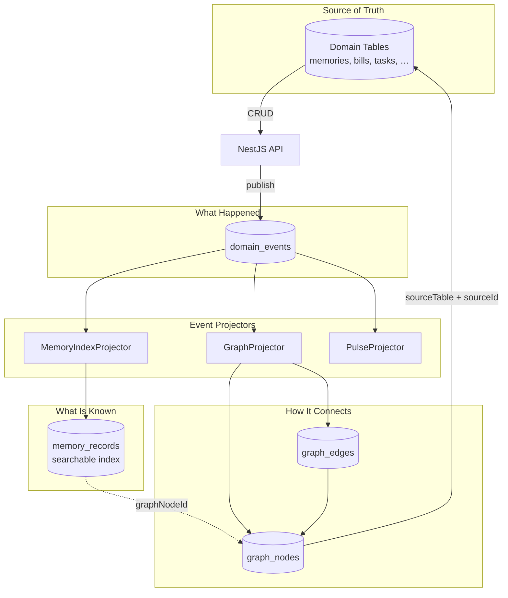
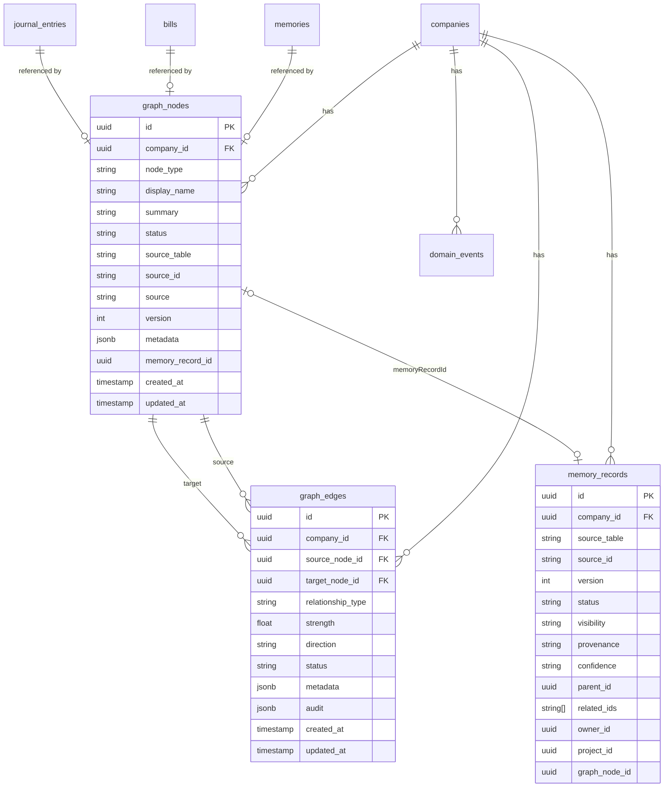
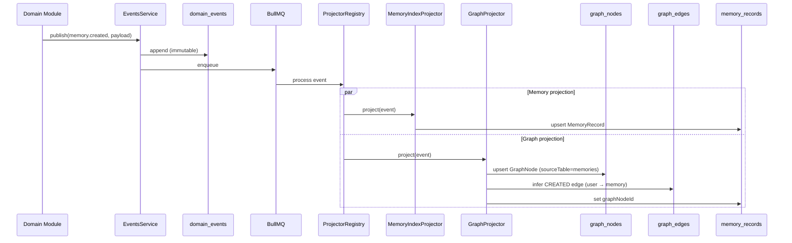

# Knowledge Graph Design Review — Phase 1.5C

**Project:** Project Grayscale  
**Date:** 2026-07-25  
**Author:** Founding Principal Engineer / CTO  
**Status:** Review complete — **awaiting approval before implementation**  
**Prerequisites:** Phase 1.5A (Event Store) ✅ · Phase 1.5B (Memory Engine) ✅ — **Approved**

---

## Executive Summary

Phase 1.5C introduces the **Company Knowledge Graph** — the third pillar of Project Grayscale's organizational intelligence model:

| Pillar | Question | System |
|--------|----------|--------|
| Domain objects | What is it? | Existing CRUD tables |
| Event Store | What happened? | `domain_events` |
| Memory Engine | What is known? | `memory_records` (searchable facade) |
| **Knowledge Graph** | **How is it connected?** | **`graph_nodes` + `graph_edges`** |

**Critical distinction:** The Knowledge Graph is **not** another storage layer for business data. It stores **relationships and references** only. Domain tables remain source of truth. Memory stores searchable knowledge. The graph stores the connective tissue executives will reason over in Sprint 2+.

**Recommendation:** Evolve Sprint 1's minimal `knowledge_nodes` / `knowledge_edges` into a formal **`GraphNode` / `GraphEdge`** model with entity references (`sourceTable`, `sourceId`), rich metadata, and seven reusable graph services. Auto-populate nodes via **`GraphProjector`** on the existing event bus; infer edges incrementally from domain events and explicit API calls.

**Scale target:** Architect for **millions of nodes and tens of millions of edges** across **thousands of companies** without schema rework. Postgres adjacency-list model with company-scoped partitioning is sufficient through ~10M edges/company; introduce read-optimized structures only when metrics demand it.

---

## Pre-Implementation Tightening — Memory Engine v2

Phase 1.5B is approved. Before Knowledge Graph implementation begins, **`memory_records` receives a non-breaking schema extension** (Migration `20260725200000_memory_v2_fields`). No behavioral changes — fields prepared, defaults applied, not yet populated by projectors.

### 1. Memory Identity

Every `MemoryRecord` already has a globally unique `id` (UUID) independent of `(sourceTable, sourceId)`. v2 formalizes the identity contract:

```typescript
interface MemoryIdentity {
  /** Globally unique memory identifier — stable across source migrations */
  id: string;                    // UUID, primary key
  companyId: string;
  sourceTable: string;           // e.g. "memories"
  sourceId: string;              // domain entity id
  version: number;               // optimistic concurrency, default 1
  status: MemoryStatus;          // active | archived | deleted
  visibility: MemoryVisibility;  // company | department | private | system
  createdAt: string;
  updatedAt: string;
}
```

**Why:** If a domain entity moves tables (e.g. `agent_recommendations` → `recommendations` in 1.5D), the MemoryRecord `id` and `graphNodeId` remain stable. Only `(sourceTable, sourceId)` updates.

| Field | Default | Populated now? |
|-------|---------|----------------|
| `version` | `1` | Yes (schema) |
| `status` | `active` | Yes (schema) |
| `visibility` | `company` | Yes (schema) |

### 2. Relationship Readiness

Prepare graph linking fields — **nullable, not populated until GraphProjector runs:**

```typescript
interface MemoryRelationshipFields {
  parentId?: string;        // MemoryRecord.id of parent
  relatedIds: string[];     // MemoryRecord.id[] — default []
  tags: string[];           // existing
  department?: string;      // existing
  ownerId?: string;         // User.id
  projectId?: string;       // future Project.id
  graphNodeId?: string;     // GraphNode.id — linked after graph projection
}
```

### 3. Memory Provenance

Every memory exposes its origin for future confidence scoring:

```typescript
const MEMORY_PROVENANCE = [
  "user_created",
  "imported",
  "github",
  "calendar",
  "plugin",
  "ai_generated",
  "ai_inferred",
  "system_generated",
  "manual",
] as const;

type MemoryProvenance = (typeof MEMORY_PROVENANCE)[number];
```

**Default mapping (projector logic, Phase 1.5C):**

| Source signal | Provenance |
|---------------|------------|
| `source: "manual"` | `user_created` |
| `source: "github"` | `github` |
| Backfill | `imported` |
| Event from billing cron | `system_generated` |
| Future plugin hook | `plugin` |

### 4. Memory Confidence

Schema only — not AI-derived yet:

```typescript
const MEMORY_CONFIDENCE = [
  "verified",    // founder explicitly confirmed
  "trusted",     // from authenticated integration
  "imported",    // bulk import, unverified
  "generated",   // rule/template produced
  "inferred",    // derived by system (future AI)
  "unknown",     // default
] as const;
```

**Default:** `unknown`. Billing reminders → `generated`. GitHub sync → `trusted`.

### 5. Memory Snapshots (Design Only)

Interfaces in `@grayscale/platform` — **no implementation in 1.5C:**

```typescript
/** Point-in-time view of company knowledge — Sprint 2+ */
interface MemorySnapshotPort {
  /** Capture current memory index state for a company at a timestamp */
  capture(companyId: string, asOf: string): Promise<MemorySnapshotId>;

  /** Query what the company "knew" on a specific date */
  queryAsOf(companyId: string, asOf: string, query: MemorySearchQuery): Promise<MemorySearchResult>;

  /** List available snapshot anchors (daily, deployment, sprint) */
  listAnchors(companyId: string): Promise<MemorySnapshotAnchor[]>;
}

interface MemorySnapshotAnchor {
  id: string;
  companyId: string;
  asOf: string;
  trigger: "scheduled" | "deployment" | "sprint" | "manual";
  recordCount: number;
}
```

**Storage strategy (future):** Event-sourced reconstruction from `domain_events` + memory index deltas, or periodic `memory_snapshot_rows` append-only table. Decision deferred to Sprint 2 when Mission Control asks *"What did we know before the outage?"*

---

## Three-Pillar Architecture



**Invariant:** Graph nodes **never duplicate** domain entity payload. They hold `displayName`, `summary`, `status`, and a pointer. Full content lives in domain tables or Memory index.

---

## Knowledge Graph Mission

The Knowledge Graph becomes the **reasoning model** of the company:

- Every significant platform object → **node**
- Every meaningful relationship → **edge**
- Sprint 2+ executives traverse the graph instead of querying isolated tables
- Mission Control consumes graph **summary APIs** (not visualization yet)

**Engineering principle:** If you can answer a question with a single table lookup, use Memory or domain CRUD. If you need *"everything connected to X"* or *"the dependency chain of Y"*, use the graph.

---

## Storage Model

### Decision: Postgres Adjacency List (AIP-8)

| Layer | Technology | Responsibility |
|-------|------------|----------------|
| **Graph store** | Postgres `graph_nodes` + `graph_edges` | Nodes, edges, traversal via recursive CTEs |
| **Entity data** | Existing domain tables | Source of truth for business payload |
| **Search index** | `memory_records` | Full-text search across knowledge |
| **History** | `domain_events` | Immutable audit + replay |
| **Transport** | BullMQ | Async projection |

### Why Not a Dedicated Graph Database (Neo4j, Neptune)?

| Alternative | Verdict |
|-------------|---------|
| **Neo4j** | Rejected for 1.5C — second datastore, backup/sync complexity, team ops burden. Revisit at >50M edges total or complex graph ML. |
| **JSON blob per company** | Rejected — no indexed traversal, no concurrent writes, no audit. |
| **Foreign keys only in domain tables** | Rejected — cannot express cross-entity relationships (Bill → Project → Founder) without schema explosion. |
| **Memory `relatedIds` only** | Rejected — insufficient for bidirectional traversal, typed edges, strength, direction. |
| **Postgres adjacency list** | **Accepted** — single backup, ACID, company-scoped indexes, recursive CTEs proven to ~10M edges. |

### Migration from Sprint 1 `knowledge_nodes` / `knowledge_edges`

Sprint 1 tables are a prototype with `label`, `nodeType`, `content` — they **duplicate data** the graph should not store.

**Migration plan:**

1. Create `graph_nodes` / `graph_edges` with full schema
2. Migrate existing rows: `knowledge_nodes` → `graph_nodes` with `nodeType: "knowledge_article"`, `sourceTable: "knowledge_nodes"`, `sourceId: id`
3. Deprecate `KnowledgeService` CRUD → redirect to `GraphNodeService` + domain table pattern
4. Drop `knowledge_nodes` / `knowledge_edges` in Phase 1.5C-final migration (after data migration + API cutover)

**Trade-off:** One-time migration complexity vs clean long-term model. Accepted.

---

## Graph Node Model

```typescript
interface GraphNode {
  id: string;                    // NodeId — globally unique UUID
  companyId: string;
  nodeType: GraphNodeType;
  displayName: string;
  summary?: string;
  status: GraphNodeStatus;       // active | archived | deleted
  sourceTable?: string;          // domain table reference (null for synthetic nodes)
  sourceId?: string;             // domain entity id
  source: GraphNodeSource;       // event | manual | import | inference
  version: number;
  metadata: Record<string, unknown>;
  memoryRecordId?: string;       // link to memory_records.id
  createdAt: string;
  updatedAt: string;
}

type GraphNodeStatus = "active" | "archived" | "deleted";
type GraphNodeSource = "event" | "manual" | "import" | "inference" | "system";
```

**Unique constraint:** `@@unique([companyId, sourceTable, sourceId])` where source is not null — one graph node per domain entity per company.

**Synthetic nodes** (no domain entity): Company root node, Department nodes — `sourceTable` null, created via `GraphNodeService.createSynthetic()`.

### Initial Node Types

```typescript
const GRAPH_NODE_TYPES = [
  "founder",
  "user",
  "company",
  "department",
  "project",
  "task",
  "meeting",
  "bill",
  "recommendation",
  "document",
  "memory",
  "architecture_decision",
  "git_commit",
  "plugin",
  "integration",
  "timeline_event",
  "notification",
  "journal_entry",
  "knowledge_article",
  "future_executive",
] as const;
```

**Mapping from domain tables:**

| Node Type | Source Table | Trigger Event |
|-----------|--------------|---------------|
| `memory` | `memories` | `memory.created` |
| `journal_entry` | `journal_entries` | `journal.entry.created` |
| `timeline_event` | `timeline_events` | `timeline.event.created` |
| `bill` | `bills` | `billing.bill.*` |
| `notification` | `notifications` | `notification.created` |
| `recommendation` | `agent_recommendations` | `agent.recommendation.created` |
| `git_commit` | `memories` (source=github) | `memory.created` |
| `integration` | `integrations` | `integration.connected` |
| `user` | `users` | membership events (future) |
| `company` | `companies` | company bootstrap |

---

## Graph Edge Model

```typescript
interface GraphEdge {
  id: string;                    // EdgeId
  companyId: string;
  sourceNodeId: string;
  targetNodeId: string;
  relationshipType: GraphRelationshipType;
  strength: number;              // 0.0 – 1.0, default 1.0
  direction: GraphEdgeDirection; // directed | bidirectional
  status: GraphEdgeStatus;       // active | archived | deleted
  metadata: Record<string, unknown>;
  audit: GraphEdgeAudit;
  createdAt: string;
  updatedAt: string;
}

interface GraphEdgeAudit {
  createdBy?: string;            // userId or "system"
  source: "event" | "manual" | "import" | "inference";
  sourceEventId?: string;        // domain_events.id
  correlationId?: string;
}

type GraphEdgeDirection = "directed" | "bidirectional";
type GraphEdgeStatus = "active" | "archived" | "deleted";
```

### Initial Relationship Types

```typescript
const GRAPH_RELATIONSHIP_TYPES = [
  "OWNS",
  "BELONGS_TO",
  "PART_OF",
  "RELATED_TO",
  "CREATED",
  "UPDATED",
  "DEPENDS_ON",
  "BLOCKS",
  "ASSIGNED_TO",
  "GENERATED",
  "REFERENCES",
  "CONNECTED_TO",
  "IMPLEMENTS",
  "DISCUSSED_IN",
  "ATTACHED_TO",
  "APPROVED_BY",
  "RECOMMENDED_BY",
] as const;
```

### Relationship Validation Matrix (subset)

| Source Type | Relationship | Target Type | Auto-inferred? |
|-------------|--------------|-------------|----------------|
| `user` | `CREATED` | `memory` | Yes (memory.created) |
| `memory` | `BELONGS_TO` | `project` | Manual / future |
| `bill` | `BELONGS_TO` | `company` | Yes (bootstrap) |
| `recommendation` | `RECOMMENDED_BY` | `future_executive` | Sprint 3 |
| `recommendation` | `REFERENCES` | `memory` | Sprint 3 |
| `git_commit` | `PART_OF` | `project` | Plugin (GitHub) |
| `task` | `DEPENDS_ON` | `task` | Manual |
| `task` | `BLOCKS` | `task` | Manual |
| `document` | `ATTACHED_TO` | `project` | Manual |
| `meeting` | `DISCUSSED_IN` | `project` | Timeline inference |

`GraphValidationService` enforces allowed `(sourceType, relationship, targetType)` tuples. Unknown combinations require explicit override flag (admin).

---

## Entity Relationship Diagram



---

## Event-Driven Graph Projection



### GraphProjector — Phase 1.5C scope

| Event | Node action | Edge inference |
|-------|-------------|----------------|
| `memory.created` | Upsert `memory` node | `user CREATED memory` (if userId) |
| `memory.deleted` | Soft-delete node | Archive connected edges |
| `journal.entry.created` | Upsert `journal_entry` node | `user CREATED journal_entry` |
| `timeline.event.created` | Upsert `timeline_event` or `meeting` | `BELONGS_TO company` |
| `notification.created` | Upsert `notification` node | `BELONGS_TO company` |
| `billing.bill.*` | Upsert `bill` node | `BELONGS_TO company` |
| `agent.recommendation.created` | Upsert `recommendation` node | `BELONGS_TO company` |
| `knowledge.node.created` | Upsert `knowledge_article` node | — |
| `integration.connected` | Upsert `integration` node | `CONNECTED_TO company` |

**Idempotency:** Upsert on `(companyId, sourceTable, sourceId)` for nodes; `(companyId, sourceNodeId, targetNodeId, relationshipType)` for edges.

---

## Graph Services

All services in `backend/src/modules/graph/`. Contracts in `packages/platform/src/graph/`.

| Service | Responsibility |
|---------|----------------|
| **GraphNodeService** | CRUD, upsert from entity, soft-delete, synthetic nodes |
| **GraphEdgeService** | CRUD, batch create, archive, strength update |
| **GraphTraversalService** | BFS/DFS neighbors, depth-limited expansion, subgraph extraction |
| **GraphSearchService** | Find nodes by type/name/metadata; relationship-filtered search |
| **GraphValidationService** | Relationship matrix, company isolation, cycle detection (optional warn) |
| **GraphImportService** | Bulk node/edge import (CSV/JSON) with validation |
| **GraphExportService** | Export subgraph as JSON/GraphML for external tools |

**No executive-specific logic.** Executives consume `GraphTraversalPort` in Sprint 3.

### Platform Ports

```typescript
interface GraphNodePort {
  upsertFromEntity(input: UpsertGraphNodeInput): Promise<GraphNode>;
  getById(companyId: string, nodeId: string): Promise<GraphNode | null>;
  getBySource(companyId: string, sourceTable: string, sourceId: string): Promise<GraphNode | null>;
  find(companyId: string, query: GraphNodeQuery): Promise<GraphNode[]>;
}

interface GraphTraversalPort {
  neighbors(companyId: string, nodeId: string, opts?: TraversalOptions): Promise<GraphNeighbor[]>;
  expand(companyId: string, nodeId: string, depth: number, opts?: TraversalOptions): Promise<GraphSubgraph>;
  shortestPath(companyId: string, fromId: string, toId: string, opts?: PathOptions): Promise<GraphPath | null>;
  relatedTo(companyId: string, query: RelatedToQuery): Promise<GraphSubgraph>;
}

interface GraphEdgePort {
  create(input: CreateGraphEdgeInput): Promise<GraphEdge>;
  archive(companyId: string, edgeId: string): Promise<void>;
  findBetween(companyId: string, sourceId: string, targetId: string): Promise<GraphEdge[]>;
}
```

---

## Traversal Specification

### Neighbor Query (1-hop)

```
GET /companies/:companyId/graph/nodes/:nodeId/neighbors
  ?relationship=REFERENCES,RELATED_TO
  &direction=outbound|inbound|both
  &nodeType=recommendation,bill
```

Returns: `{ node, edge, neighborNode }[]`

### Expansion (N-hop BFS)

```
GET /companies/:companyId/graph/nodes/:nodeId/expand?depth=3&limit=500
```

Returns: `{ nodes: GraphNode[], edges: GraphEdge[], truncated: boolean }`

**Depth cap:** Default 3, max 5 (configurable). Prevents runaway queries.

### Shortest Path

Postgres recursive CTE:

```sql
WITH RECURSIVE path AS (
  SELECT source_node_id, target_node_id, relationship_type, 1 AS depth,
         ARRAY[source_node_id] AS visited
  FROM graph_edges
  WHERE company_id = $1 AND source_node_id = $2 AND status = 'active'
  UNION ALL
  SELECT e.source_node_id, e.target_node_id, e.relationship_type, p.depth + 1,
         p.visited || e.target_node_id
  FROM graph_edges e
  JOIN path p ON e.source_node_id = p.target_node_id
  WHERE e.company_id = $1 AND e.status = 'active'
    AND NOT e.target_node_id = ANY(p.visited)
    AND p.depth < $4
)
SELECT * FROM path WHERE target_node_id = $3 ORDER BY depth LIMIT 1;
```

### Future Query Examples (supported by API design)

| Natural language | API mapping |
|------------------|-------------|
| "Everything related to Project Grayscale" | `relatedTo({ q: "Project Grayscale", nodeType: project })` + expand depth=2 |
| "Everything connected to Authentication" | `search({ q: "Authentication" })` → expand each hit |
| "Recommendations related to Billing" | `expand(billNodeId)` filtered by `nodeType=recommendation` |
| "Documents attached to a project" | `neighbors(projectId, { relationship: ATTACHED_TO, direction: inbound })` |
| "Dependency chain of a task" | `expand(taskId, { relationship: DEPENDS_ON, direction: outbound, depth: 10 })` |
| "Everything that changed after deployment" | Cross-reference `domain_events.createdAt > T` → node lookup by source |
| "Relationships connected to founder" | `neighbors(founderNodeId, { direction: both })` |

---

## Mission Control Integration

Summary APIs only — **no visualization in 1.5C.**

```
GET /companies/:companyId/graph/summary
```

Response:

```typescript
interface GraphSummary {
  companyId: string;
  nodeCount: number;
  edgeCount: number;
  byNodeType: Record<GraphNodeType, number>;
  byRelationshipType: Record<GraphRelationshipType, number>;
  recentNodes: GraphNode[];       // last 10
  hubNodes: GraphHub[];           // top 5 by edge count
  orphanNodes: number;            // nodes with 0 edges (health signal)
}

interface GraphHub {
  nodeId: string;
  displayName: string;
  nodeType: GraphNodeType;
  edgeCount: number;
}
```

Mission Control "Connections" panel consumes this + `GET /graph/nodes/:id/expand?depth=1` for drill-down (Sprint 1.5G wiring).

---

## Scalability Analysis

### Target Scale

| Metric | 1.5C design target | Hard limit (Postgres) | Revisit trigger |
|--------|-------------------|----------------------|-----------------|
| Companies | 10,000 | — | — |
| Nodes / company | 100,000 | ~1M | >500K avg |
| Edges / company | 1,000,000 | ~10M | >5M avg |
| Traversal depth | 5 hops | — | latency >200ms p95 |
| Total platform edges | 10,000,000 | ~100M | Neo4j evaluation |

### Indexing Strategy

```sql
-- Nodes
CREATE INDEX graph_nodes_company_type_idx ON graph_nodes (company_id, node_type);
CREATE UNIQUE INDEX graph_nodes_company_source_idx ON graph_nodes (company_id, source_table, source_id)
  WHERE source_table IS NOT NULL;
CREATE INDEX graph_nodes_display_name_trgm ON graph_nodes USING gin (display_name gin_trgm_ops);

-- Edges
CREATE INDEX graph_edges_company_source_idx ON graph_edges (company_id, source_node_id);
CREATE INDEX graph_edges_company_target_idx ON graph_edges (company_id, target_node_id);
CREATE INDEX graph_edges_company_rel_idx ON graph_edges (company_id, relationship_type);
CREATE UNIQUE INDEX graph_edges_unique_rel ON graph_edges (company_id, source_node_id, target_node_id, relationship_type)
  WHERE status = 'active';
```

### Partitioning (Sprint 2+)

When `graph_edges` exceeds 50M rows: **range partition by `company_id` hash** or migrate hot companies to dedicated schemas. Not needed for 1.5C.

### Caching (Sprint 2+)

- Redis cache for `GraphSummary` (TTL 60s)
- Materialized view `graph_node_degree` refreshed on edge write (hub detection)

---

## Future Executive Reasoning

Sprint 3 executives receive a **`CompanyGraphContext`** assembled by the platform:

```typescript
interface CompanyGraphContext {
  /** Seed nodes relevant to the executive's domain */
  seedNodes: GraphNode[];
  /** 2-hop subgraph around seeds */
  subgraph: GraphSubgraph;
  /** Related memory records (via graphNodeId) */
  memories: MemoryRecord[];
  /** Recent events for seed entities */
  recentEvents: PlatformEvent[];
}
```

**Example — Ledger (Finance executive):**

1. Seed: all `bill` nodes + `recommendation` where metadata.department = "finance"
2. Expand 2 hops → surfaces connected projects, approvals, meetings
3. Memory search on linked `memoryRecordId`s for context
4. Event store replay for "what changed since last run"

**The executive never queries `bills` directly.** It receives pre-assembled graph context from `GraphTraversalService.buildExecutiveContext(executiveId, companyId)`.

This is **Sprint 3 scope** — 1.5C delivers the ports and services executives will call.

---

## Trade-offs

| Decision | Benefit | Cost | Revisit when |
|----------|---------|------|--------------|
| Postgres adjacency list | Single DB, ACID, familiar ops | Traversal slower than Neo4j at scale | p95 traversal >200ms |
| Entity-reference nodes (no payload) | No duplication, single source of truth | Extra hop to hydrate entity | Never — core principle |
| Soft-delete nodes/edges | Audit trail, replay safety | Storage growth | Retention policy Sprint 2 |
| Inferred edges from events | Graph grows automatically | Possible false positives | Confidence scoring Sprint 3 |
| Relationship validation matrix | Prevents nonsense edges | Slower edge creation | Allow override for admins |
| Migrate Sprint 1 knowledge tables | Clean model | One-time migration | Done in 1.5C |
| Memory v2 fields (empty) | Future-proof | Wider rows | Populate in 1.5C projector |

---

## Alternative Approaches Considered

### A. Knowledge Graph as Memory `relatedIds` only

Extend `memory_records.relatedIds[]` without a graph table.

**Rejected:** No typed relationships, no bidirectional traversal, no strength/direction, no shortest path. Insufficient for executive reasoning.

### B. Graph database (Neo4j) from day one

**Rejected:** Operational complexity, dual-write to Postgres domain tables, cost. Postgres handles 1.5C scale. Export via `GraphExportService` enables future Neo4j sync if needed.

### C. Graph as JSON document per company

Store `{ nodes: [], edges: [] }` in a single JSONB column.

**Rejected:** No indexed traversal, lock contention on writes, cannot scale past small companies.

### D. Duplicate entity data into graph nodes

Store full `content` in `graph_nodes.summary` and sync on every update.

**Rejected:** Violates "graph never duplicates business data." `displayName` + `summary` (≤500 chars) allowed as denormalized **index hints** only; hydration always goes to source.

### E. Keep Sprint 1 `knowledge_nodes` as the graph

**Rejected:** Missing entity references, audit, relationship types, validation, services. Prototype only.

---

## Testing Strategy (80%+ coverage)

| Module | Unit tests | Integration tests |
|--------|-----------|-------------------|
| GraphNodeService | upsert, soft-delete, synthetic | Postgres |
| GraphEdgeService | create, archive, uniqueness | Postgres |
| GraphValidationService | matrix enforcement, company isolation | — |
| GraphTraversalService | BFS, shortest path, depth cap | seeded graph |
| GraphSearchService | type filter, text search | — |
| GraphImportService | CSV parse, validation errors | — |
| GraphExportService | JSON round-trip | — |
| GraphProjector | event → node + edge mapping | event replay |
| Memory v2 migration | defaults applied | schema |

**Fixtures:** Factory for `createTestGraph()` with company → project → task → bill chain.

---

## Implementation Phases (1.5C sub-phases)

| Sub-phase | Deliverable | Duration est. |
|-----------|-------------|---------------|
| **1.5C-0** | Memory v2 schema migration (identity, provenance, confidence, relationship fields) | 0.5 day |
| **1.5C-1** | `@grayscale/platform/graph` types + ports | 0.5 day |
| **1.5C-2** | `graph_nodes` + `graph_edges` schema + migrate Sprint 1 knowledge tables | 1 day |
| **1.5C-3** | GraphNodeService + GraphEdgeService + GraphValidationService | 1 day |
| **1.5C-4** | GraphTraversalService + GraphSearchService | 1.5 days |
| **1.5C-5** | GraphProjector + Memory↔Graph linking | 1 day |
| **1.5C-6** | GraphImportService + GraphExportService | 1 day |
| **1.5C-7** | REST API + Mission Control summary endpoint | 1 day |
| **1.5C-8** | Tests (80%+) + documentation | 1.5 days |

**Total:** ~8 days

---

## Documentation Deliverables (upon implementation)

| Document | Path |
|----------|------|
| This review | `docs/architecture/KNOWLEDGE_GRAPH_DESIGN_REVIEW.md` |
| ADR-008 Knowledge Graph | `docs/architecture/ADR-008-knowledge-graph.md` |
| Graph architecture | `docs/platform/KNOWLEDGE_GRAPH.md` |
| Node specification | `docs/platform/GRAPH_NODE_SPEC.md` |
| Relationship specification | `docs/platform/GRAPH_RELATIONSHIP_SPEC.md` |
| Traversal specification | `docs/platform/GRAPH_TRAVERSAL_SPEC.md` |
| Graph API reference | `docs/platform/GRAPH_API.md` |
| Memory snapshot interfaces | `docs/platform/MEMORY_SNAPSHOTS.md` (design only) |
| ER diagram | Embedded in this review + `docs/platform/DATA_MODEL.md` update |

---

## Success Criteria — Phase 1.5C

- [ ] Memory v2 fields migrated (schema only, defaults set)
- [ ] `graph_nodes` + `graph_edges` operational with entity references
- [ ] Sprint 1 knowledge tables migrated and deprecated
- [ ] Seven graph services implemented and tested (80%+ coverage)
- [ ] GraphProjector auto-creates nodes from domain events
- [ ] MemoryRecord ↔ GraphNode bidirectional link (`graphNodeId`)
- [ ] Traversal: neighbors, expand, shortest path
- [ ] Mission Control graph summary API
- [ ] Import/export functional
- [ ] Zero executive-specific logic
- [ ] Full documentation generated

---

## Decisions Required

**Approve this design to begin Phase 1.5C implementation.**

Confirm or adjust:

1. **AIP-8:** Postgres adjacency list (not Neo4j) for Knowledge Graph
2. **AIP-9:** Migrate Sprint 1 `knowledge_nodes` → `graph_nodes` (not parallel systems)
3. **Memory v2 schema extension** before graph work (1.5C-0)
4. **Graph nodes reference domain entities** — no payload duplication
5. **Sub-phase ordering** — any reprioritization?

---

**Related:** [MEMORY_ENGINE.md](../platform/MEMORY_ENGINE.md) · [ADR-007](./ADR-007-memory-index-facade.md) · [ADR-006](./ADR-006-event-store.md) · [SPRINT_1_5_CORE_PLATFORM.md](../engineering/SPRINT_1_5_CORE_PLATFORM.md)
