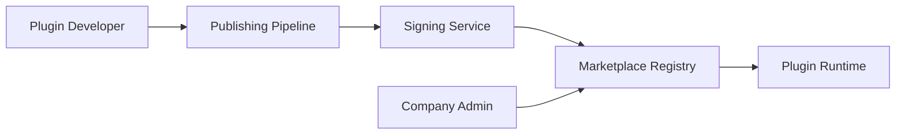

# Marketplace Architecture

Phase 1.5F — architecture foundation only. **No UI in 1.5F.**

## Purpose

Design the data model and workflows for a future plugin marketplace where third-party developers publish, sign, and distribute plugins for Project Grayscale.

## Concepts



## Data Model (Future)

```prisma
model MarketplacePlugin {
  id              String
  pluginId        String   @unique  // manifest id
  name            String
  author          String
  publisherId     String
  category        String
  description     String
  license         String
  verified        Boolean  @default(false)
  createdAt       DateTime
}

model MarketplaceVersion {
  id              String
  marketplacePluginId String
  version         String
  minPlatformVersion String
  manifestHash    String
  signature       String   // Ed25519
  publishedAt     DateTime
  changelog       String?
  @@unique([marketplacePluginId, version])
}

model MarketplacePublisher {
  id              String
  name            String
  publicKey       String   // Ed25519 public key
  verified        Boolean
}

model MarketplaceReview {
  id              String
  marketplacePluginId String
  companyId       String
  rating          Int
  comment         String?
  createdAt       DateTime
}
```

## Publishing Workflow

1. Developer builds plugin package with `@grayscale/plugin-sdk`
2. Manifest + bundle submitted to publishing API
3. Automated checks: manifest validation, permission audit, semver compatibility
4. Publisher signs with Ed25519 private key
5. Version registered in marketplace registry
6. Companies browse/install via Mission Control (1.5G+)

## Signing & Verification

- Publishers register Ed25519 public keys
- Each version signed: `sign(manifestHash + version)`
- Plugin Runtime verifies signature before install
- First-party plugins (`io.grayscale.*`) auto-verified

## Categories

| Category | Examples |
|----------|----------|
| development | GitHub, GitLab, Cursor |
| communication | Slack, Discord |
| finance | Stripe, billing |
| design | Figma, Canva |
| productivity | Google Workspace, M365 |
| infrastructure | Cloudflare, Vultr |

## Licensing

Manifest `license` field: `MIT`, `Apache-2.0`, `proprietary`, `first_party`

## Compatibility Matrix

Platform maintains compatibility table:

```
platform 1.5.x ↔ plugin 1.x.x
platform 2.0.x ↔ plugin 2.x.x
```

Install rejected if `minPlatformVersion` not satisfied.

## Out of Scope (1.5F)

- Marketplace UI
- Payment/revenue share
- Community reviews UI
- Third-party publisher onboarding flow

## 1.5F Deliverable

- Schema migration (tables created, empty)
- Interface definitions in `@grayscale/platform`
- Documentation (this file)

See [INTEGRATION_PLUGIN_PLATFORM_DESIGN_REVIEW.md](./INTEGRATION_PLUGIN_PLATFORM_DESIGN_REVIEW.md).
