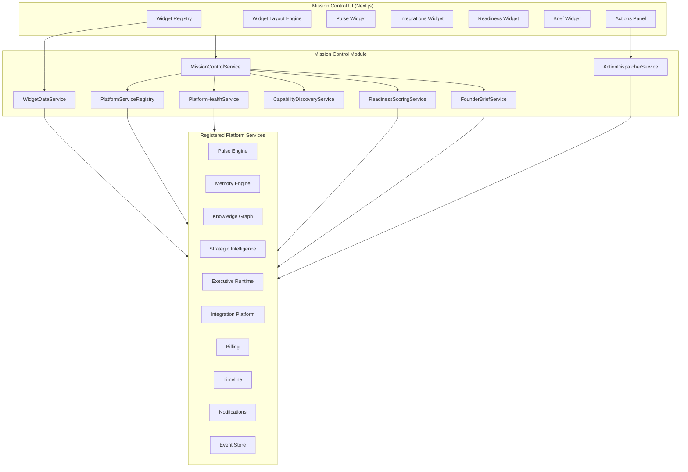
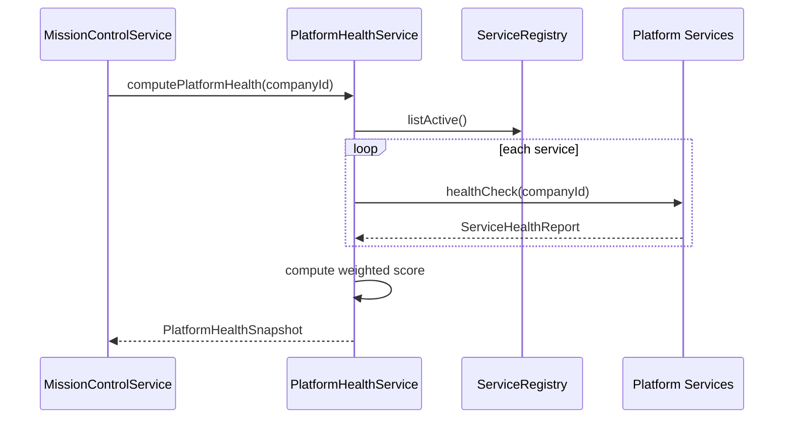
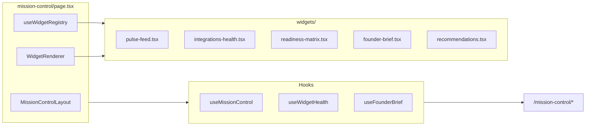
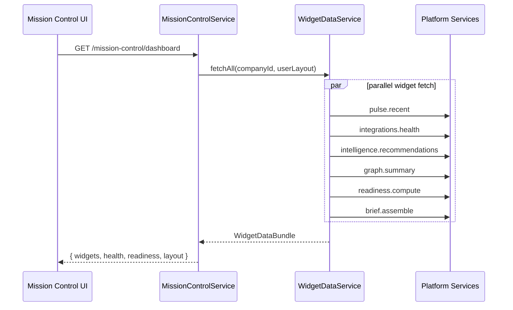
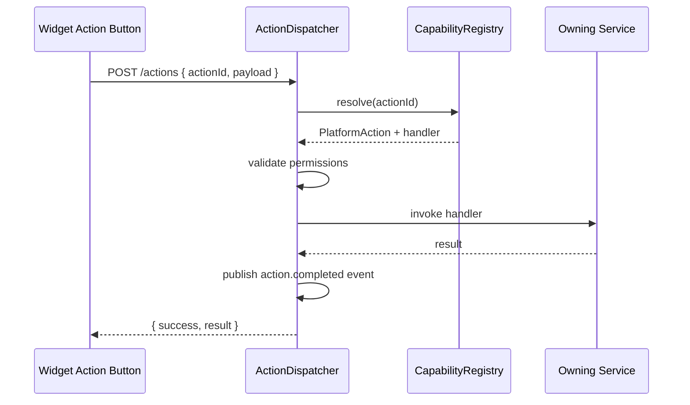

# Mission Control Live — Design Review (Phase 1.5G)

**Project:** Project Grayscale  
**Date:** 2026-07-25  
**Author:** Founding Principal Engineer / CTO  
**Status:** Approved — **implemented** (Phase 1.5G complete)  
**Prerequisites:** Phase 1.5A (Event Store) ✅ · 1.5B (Memory Engine) ✅ · 1.5C (Knowledge Graph) ✅ · 1.5D (Strategic Intelligence) ✅ · 1.5E (Executive Runtime) ✅ · 1.5F (Integration & Plugin Platform) ✅ — **Approved**

---

## Executive Summary

Phase 1.5G delivers **Mission Control Live** — the operational command center of the Company Operating System.

**Core thesis:** Mission Control is not a traditional analytics dashboard. It is a **widget-driven operations center** that reflects live platform state exclusively through Core Platform APIs. No duplicate business logic. No duplicate storage. No static dashboard data.

**Recommendation:** Introduce seven foundational frameworks — **Platform Service Registry**, **Platform Health Framework**, **Capability Discovery**, **Widget Framework**, **Operations Center Actions**, **Company Readiness Framework**, and **Founder Daily Brief Framework** — then wire the existing Mission Control UI to live aggregation APIs.

**Scale target:** Sub-500ms full dashboard aggregation per company, 20+ independently refreshable widgets, dynamic service discovery without hardcoded module lists, unified Platform Health Score computed from 15+ registered services.

**Out of scope for 1.5G:** LLM-generated brief narratives, third-party widget marketplace UI, WASM plugin panels, executive agent execution (`EXECUTIVES_ENABLED=false` remains), full SSE everywhere (polling acceptable with honest empty states).

---

## Updated Foundation Roadmap

```
Phase 1.5F  Integration & Plugin Platform     ✅ complete
     ↓
Phase 1.5G  Mission Control Live              ← THIS REVIEW
     ↓
Phase 1.5H  Platform Operations & Reliability
     ↓
FOUNDATION COMPLETE → Sprint 2 (Executive Systems)
```

Sprint 2 (Athena, Atlas, Ledger, etc.) begins **only after Foundation is complete**.

---

## Mission Statement

Mission Control must answer, in real time:

1. **Is the platform healthy?** — unified health score, per-service status, integration states
2. **Is the company ready?** — engineering, finance, security, growth readiness dimensions
3. **What needs action today?** — priorities, blocked work, bills, meetings, recommendations
4. **What happened recently?** — pulse feed, timeline, events, sync activity
5. **What can I do?** — approve, reject, create, schedule, install, retry — via action interfaces

Every answer comes from **live platform APIs**, not from `mission-control-data.ts`.

---

## Current State Assessment

| Component | Maturity | Location | Gap |
|-----------|----------|----------|-----|
| Mission Control UI | ~35% | `apps/web/.../mission-control/page.tsx` | 90% static data from `mission-control-data.ts` |
| Pulse feed | Live | `/pulse/health`, `/pulse/recent`, `/pulse/stream` | Only widget wired live |
| Integration health | Live | `/platform/integrations/health` | Not consumed by UI |
| Intelligence summary | Live | `/intelligence/summary`, `/recommendations` | Not consumed by UI |
| Graph summary | Live | `/graph/summary`, `/graph/health` | Not consumed by UI |
| Memory search | Live | `/memory/search` | Not consumed by UI |
| Founder dashboard | Partial | `/dashboard/companies/:id/founder` | Ad-hoc Prisma queries, not registry-driven |
| Daily briefing | Partial | `/dashboard/companies/:id/briefing` | String concatenation, not brief framework |
| Service registry | None | — | Modules exist but do not self-register |
| Widget framework | None | — | Hardcoded React sections |
| Action interfaces | Partial | Intelligence recommendation status, sync trigger | No unified action port |
| Readiness scoring | Static | `mission-control-data.ts` | Hardcoded percentages |
| Platform health score | Partial | Pulse health only | No cross-service aggregation |

**Primary anti-pattern to eliminate:** `apps/web/src/lib/mission-control-data.ts` as a second source of truth (identified in AIP-6).

---

## Target Architecture



**Invariant:** Mission Control **aggregates and orchestrates**; it **never owns domain data**.

---

## Architectural Additions

### AIP-26: Platform Service Registry

Every platform module self-registers at startup via `PlatformServiceRegistryPort`.

**Registration contract:**

```typescript
interface PlatformServiceRegistration {
  id: string;                    // "memory-engine"
  name: string;                  // "Memory Engine"
  version: string;               // semver
  module: string;                // NestJS module name
  status: "active" | "degraded" | "disabled";
  capabilities: PlatformCapability[];   // AIP-28
  dependencies: string[];        // other service ids
  routes: ServiceRoute[];        // documented API surface
  documentation: string;           // path to docs
  healthCheck: () => Promise<ServiceHealthReport>;  // AIP-27
  metrics?: () => Promise<ServiceMetrics>;
}
```

**Rules:**

- Mission Control discovers services via `GET /platform/registry` — **never hardcodes** module lists
- Registration is idempotent; last registration wins on hot reload
- Disabled services (e.g. Executive Runtime when `EXECUTIVES_ENABLED=false`) register with `status: "disabled"` and explicit reason
- Intelligence engines, connectors, and plugins extend the registry via nested registries

**Initial registrations (1.5G):**

| Service ID | Module | Version |
|------------|--------|---------|
| `event-store` | EventsModule | 1.0 |
| `memory-engine` | MemoryModule | 1.0 |
| `knowledge-graph` | GraphModule | 1.0 |
| `strategic-intelligence` | IntelligenceModule | 1.0 |
| `executive-runtime` | ExecutiveModule | 1.0 |
| `integration-platform` | IntegrationPlatformModule | 1.0 |
| `pulse-engine` | PulseModule | 1.0 |
| `plugin-runtime` | PluginsModule + IntegrationPlatformModule | 1.0 |
| `timeline` | TimelineModule | 1.0 |
| `billing` | BillingModule | 1.0 |
| `notifications` | NotificationsModule | 1.0 |
| `mission-control` | MissionControlModule | 1.0 |

---

### AIP-27: Platform Health Framework

Every registered service exposes standardized health via `healthCheck()`.

**Health report contract:**

```typescript
interface ServiceHealthReport {
  serviceId: string;
  health: "healthy" | "degraded" | "unhealthy" | "unknown";
  availability: number;          // 0.0–1.0
  latencyMs: number;             // p95 health probe latency
  readiness: boolean;            // can accept requests
  warnings: string[];
  errors: string[];
  coverage?: number;             // test coverage if applicable
  operationalCostCents?: number; // monthly estimate if applicable
  checkedAt: string;
}
```

**Unified Platform Health Score:**

```
PlatformHealthScore = weighted average of:
  - Service availability (40%)
  - Integration health from 1.5F (20%)
  - Pulse health score (15%)
  - Readiness dimensions (15%)
  - Error/warning density (10%)
```

Score range: 0–100. Mission Control displays score + breakdown by dimension.

**Health aggregation flow:**



**Existing health endpoints consumed (not duplicated):**

- `/pulse/health`
- `/graph/health`
- `/platform/integrations/health/summary`
- `/platform/plugins/health`
- `/executive-runtime/status`

---

### AIP-28: Capability Discovery

Capabilities are first-class platform metadata, reusable by Mission Control, APIs, and future executive systems.

**Capability contract:**

```typescript
interface PlatformCapability {
  id: string;                    // "memory.search"
  name: string;                  // "Memory Search"
  category: CapabilityCategory;
  serviceId: string;
  route?: string;                // primary API route
  permissions?: string[];        // required grants
  description?: string;
}

type CapabilityCategory =
  | "memory"
  | "graph"
  | "intelligence"
  | "integration"
  | "plugin"
  | "executive"
  | "billing"
  | "timeline"
  | "notification"
  | "operations";
```

**Initial capability catalog:**

| Capability ID | Service | Route |
|---------------|---------|-------|
| `memory.search` | memory-engine | `GET /memory/search` |
| `memory.recent` | memory-engine | `GET /memory/recent` |
| `graph.traversal` | knowledge-graph | `GET /graph/nodes/:id/expand` |
| `graph.summary` | knowledge-graph | `GET /graph/summary` |
| `intelligence.strategy` | strategic-intelligence | `GET /intelligence/summary` |
| `intelligence.recommendations` | strategic-intelligence | `GET /intelligence/recommendations` |
| `intelligence.goals` | strategic-intelligence | `GET /intelligence/goals` |
| `integration.health` | integration-platform | `GET /platform/integrations/health` |
| `integration.sync` | integration-platform | `POST /platform/integrations/:provider/sync` |
| `plugin.install` | integration-platform | `POST /platform/plugins/:id/install` |
| `executive.context` | executive-runtime | `GET /executive-runtime/context` |
| `billing.upcoming` | billing | `GET /billing/bills` |
| `timeline.recent` | timeline | `GET /timeline/events` |
| `notification.unread` | notifications | `GET /notifications` |
| `pulse.stream` | pulse-engine | `GET /pulse/stream` |
| `operations.actions` | mission-control | `POST /mission-control/actions` |

**Discovery API:** `GET /platform/capabilities` — filterable by category, service, permission.

Executives in Sprint 2 will consume the same capability catalog via `CapabilityRegistryService` (already exists in Executive Runtime — unify under platform registry in 1.5G).

---

### AIP-29: Widget Framework

Mission Control is **widget-driven**. Widgets are independently installable, removable, and configurable.

**Widget contract:**

```typescript
interface MissionControlWidget {
  id: string;                    // "pulse-feed"
  name: string;
  category: WidgetCategory;
  dataProvider: string;          // capability id or custom provider key
  refreshPolicy: RefreshPolicy;
  permissions: string[];         // user must hold to see widget
  actions?: WidgetAction[];      // inline actions (AIP-30)
  configSchema?: Record<string, unknown>;  // JSON Schema
  layout: WidgetLayoutMetadata;
  emptyState?: string;           // honest message when no data
}

interface RefreshPolicy {
  mode: "realtime" | "polling" | "manual";
  intervalSeconds?: number;      // for polling
  sseEndpoint?: string;          // for realtime
}

interface WidgetLayoutMetadata {
  defaultWidth: 1 | 2;           // grid columns (1 or 2 of 2-col layout)
  defaultHeight: "compact" | "standard" | "tall";
  minHeight?: number;
  order: number;
  collapsible: boolean;
}
```

**Widget catalog (1.5G launch set):**

| Widget ID | Data Source | Refresh | Replaces static panel |
|-----------|-------------|---------|----------------------|
| `platform-health` | PlatformHealthService | 30s poll | Sprint banner score |
| `pulse-feed` | `/pulse/recent` + SSE | realtime | The Pulse (partially live) |
| `integrations-health` | `/platform/integrations/health` | 60s poll | — (new) |
| `recommendations` | `/intelligence/recommendations` | 60s poll | — (new) |
| `upcoming-bills` | `/billing/bills?upcoming=true` | 5m poll | Infrastructure Costs (partial) |
| `timeline-today` | `/timeline/events?today=true` | 60s poll | Today's Tasks |
| `graph-summary` | `/graph/summary` | 5m poll | — (new) |
| `readiness-matrix` | ReadinessScoringService | 5m poll | Foundation Readiness |
| `founder-brief` | FounderBriefService | daily | — (new) |
| `recent-events` | Event store recent | 30s poll | — (new) |
| `plugin-status` | `/platform/plugins/health` | 60s poll | — (new) |
| `engineering-journal` | `/memory/search?type=journal` | 5m poll | Platform WIP (derived) |

**Removed / honestly empty in 1.5G:**

| Static panel | 1.5G behavior |
|--------------|---------------|
| Known Issues | Empty state + link to engineering journal; no fake bug list |
| Code Coverage | CI artifact endpoint or honest "not configured" |
| Infrastructure Costs | Integration cost monitor + billing; no hardcoded estimates |
| Estimated Time to MVP | Removed until Sprint 2 planning module exists |
| Backlog | Empty or sourced from intelligence goals if configured |
| Foundation Completed | Pulse events + timeline; not static checklist |

**Layout persistence:** `MissionControlLayout` Prisma model stores per-user widget configuration (order, visibility, collapse state).

---

### AIP-30: Operations Center Actions

Mission Control supports **actions** in addition to visualization. Actions are reusable across widgets, APIs, and future executive systems.

**Action contract:**

```typescript
interface PlatformAction {
  id: string;                    // "recommendation.approve"
  name: string;
  category: ActionCategory;
  capabilityId: string;          // required capability
  permission: string;
  inputSchema: Record<string, unknown>;  // JSON Schema
  async: boolean;                // returns job id if true
  handler: ActionHandlerRef;     // service method reference
}

type ActionCategory =
  | "recommendation"
  | "goal"
  | "task"
  | "meeting"
  | "notification"
  | "plugin"
  | "integration"
  | "executive";
```

**Initial action catalog:**

| Action ID | Handler | Capability |
|-----------|---------|------------|
| `recommendation.approve` | IntelligenceModule | `intelligence.recommendations` |
| `recommendation.reject` | IntelligenceModule | `intelligence.recommendations` |
| `goal.create` | IntelligenceModule | `intelligence.goals` |
| `task.create` | TimelineModule | `timeline.recent` |
| `meeting.schedule` | TimelineModule | `timeline.recent` |
| `notification.send` | NotificationsModule | `notification.unread` |
| `plugin.install` | IntegrationPlatformModule | `plugin.install` |
| `integration.retry-sync` | IntegrationPlatformModule | `integration.sync` |

**Unified dispatch:** `POST /companies/:companyId/mission-control/actions`

```json
{
  "actionId": "recommendation.approve",
  "payload": { "recommendationId": "rec-123", "actorId": "user-1" }
}
```

Mission Control UI contains **no business-specific logic** — widgets declare available actions; the action dispatcher routes to the owning service.

---

### AIP-31: Company Readiness Framework

Expose deterministic readiness scoring across company dimensions.

**Readiness dimensions:**

| Dimension | Signals (live APIs) | Weight |
|-----------|---------------------|--------|
| Engineering | Graph git_commit count, sync health, test coverage artifact | 15% |
| Operations | Pulse health, timeline completion rate | 10% |
| Finance | Bills paid ratio, upcoming overdue count | 10% |
| Security | Credential vault audit, integration auth states | 10% |
| Marketing | Memory/knowledge tagged marketing (if any) | 5% |
| Growth | Goals/objectives count, recommendation velocity | 10% |
| Infrastructure | Integration cost, platform health | 10% |
| Hiring | Placeholder — 0 until HR module (honest empty) | 5% |
| Product | Knowledge nodes, decisions count | 10% |
| Legal | Placeholder — 0 until legal module (honest empty) | 5% |
| Platform | Platform Health Score (AIP-27) | 10% |

**Output contract:**

```typescript
interface CompanyReadinessSnapshot {
  companyId: string;
  overallScore: number;          // 0–100
  dimensions: ReadinessDimension[];
  computedAt: string;
  dataCompleteness: number;      // % dimensions with real signals
}

interface ReadinessDimension {
  id: string;
  name: string;
  score: number;
  signals: ReadinessSignal[];
  status: "ready" | "developing" | "at_risk" | "unknown";
}
```

**Rules:**

- Dimensions without data sources return `status: "unknown"` — never fake scores
- `dataCompleteness` displayed in UI so founders know when scores are partial
- Replaces static `readinessFactors` in `mission-control-data.ts`

---

### AIP-32: Founder Daily Brief Framework

Deterministic data assembly for the founder's daily operational summary. **No language generation in 1.5G.**

**Brief sections:**

```typescript
interface FounderDailyBrief {
  companyId: string;
  briefingDate: string;          // ISO date
  sections: {
    todaysPriorities: PriorityItem[];       // from intelligence priorities
    blockedWork: BlockedItem[];             // failed syncs, degraded plugins, overdue items
    upcomingBills: BillSummary[];           // billing module
    upcomingMeetings: MeetingSummary[];     // timeline events today+
    engineeringStatus: EngineeringStatus;   // sync health, recent commits
    platformHealth: PlatformHealthSnapshot; // AIP-27
    cashPosition: CashSummary;              // bills paid/unpaid totals
    topRecommendations: Recommendation[];   // intelligence open recs
    recentEvents: PlatformEventSummary[];   // event store last 24h
    riskChanges: RiskChange[];              // intelligence risks delta
  };
  assembledAt: string;
  version: number;
}
```

**Assembly rules:**

1. Each section fetched from owning service — no cross-module Prisma in `DashboardService`
2. Brief cached in `daily_briefings` table (existing model) as structured JSON
3. Cache invalidated on: new recommendation, bill due, integration failure, priority change
4. `GET /mission-control/brief` returns cached or assembles fresh
5. Sprint 2 may add LLM narrative layer on top — brief framework remains deterministic base

**Migrates:** `DashboardService.getDailyBriefing()` → `FounderBriefService.assemble()`

---

## Platform Contracts (`@grayscale/platform`)

New exports under `packages/platform/src/mission-control/`:

```
mission-control/
  registry.ts       — PlatformServiceRegistration, PlatformServiceRegistryPort
  health.ts         — ServiceHealthReport, PlatformHealthSnapshot
  capabilities.ts   — PlatformCapability, CapabilityDiscoveryPort
  widgets.ts        — MissionControlWidget, WidgetDataPort
  actions.ts        — PlatformAction, ActionDispatcherPort
  readiness.ts      — CompanyReadinessSnapshot, ReadinessScoringPort
  brief.ts          — FounderDailyBrief, FounderBriefPort
```

---

## Backend Module Structure

```
backend/src/modules/mission-control/
  mission-control.module.ts
  mission-control.controller.ts
  mission-control.service.ts          — dashboard aggregation orchestrator
  platform-service-registry.service.ts
  platform-health.service.ts
  capability-discovery.service.ts
  widget-data.service.ts
  action-dispatcher.service.ts
  readiness-scoring.service.ts
  founder-brief.service.ts
  service-registrations/              — per-module registration on init
    pulse.registration.ts
    memory.registration.ts
    graph.registration.ts
    intelligence.registration.ts
    integration.registration.ts
    executive.registration.ts
    ...
```

Each existing module calls `registry.register(...)` in `OnModuleInit`.

---

## API Surface

Base path: `/companies/:companyId/mission-control`

| Method | Path | Description |
|--------|------|-------------|
| GET | `/dashboard` | Full widget data bundle (parallel fetch) |
| GET | `/health` | Unified platform health score + breakdown |
| GET | `/readiness` | Company readiness snapshot |
| GET | `/brief` | Founder daily brief (deterministic) |
| GET | `/widgets` | Widget catalog + user layout |
| PUT | `/widgets/layout` | Save user widget configuration |
| GET | `/widgets/:widgetId/data` | Single widget data fetch |
| POST | `/actions` | Unified action dispatch |
| GET | `/capabilities` | Capability discovery (alias to platform) |

Platform-level (not company-scoped):

| Method | Path | Description |
|--------|------|-------------|
| GET | `/platform/registry` | All registered services |
| GET | `/platform/capabilities` | Full capability catalog |
| GET | `/platform/health` | Global platform health (no company context) |

See [MISSION_CONTROL_API.md](../api/MISSION_CONTROL_API.md) for full specification.

---

## Frontend Architecture



**Rules:**

1. Delete `mission-control-data.ts` after all widgets live
2. Each widget is a self-contained component with loading/error/empty states
3. Widget registry loaded from API — default layout shipped as seed, user overrides persisted
4. Actions rendered via generic `ActionButton` from action metadata

---

## Data Flow: Full Dashboard Load



Target: **p95 < 500ms** for full dashboard with 12 widgets (parallel fetch, no N+1).

---

## Prisma Additions

```prisma
model MissionControlLayout {
  id        String   @id @default(uuid())
  companyId String   @map("company_id")
  userId    String   @map("user_id")
  widgets   Json     // ordered widget config[]
  updatedAt DateTime @updatedAt @map("updated_at")

  @@unique([companyId, userId])
  @@map("mission_control_layouts")
}

model PlatformHealthSnapshot {
  id        String   @id @default(uuid())
  companyId String   @map("company_id")
  score     Int
  breakdown Json
  recordedAt DateTime @default(now()) @map("recorded_at")

  @@index([companyId, recordedAt])
  @@map("platform_health_snapshots")
}

model ReadinessSnapshot {
  id        String   @id @default(uuid())
  companyId String   @map("company_id")
  overallScore Int   @map("overall_score")
  dimensions Json
  dataCompleteness Float @map("data_completeness")
  recordedAt DateTime @default(now()) @map("recorded_at")

  @@index([companyId, recordedAt])
  @@map("readiness_snapshots")
}
```

Extend existing `DailyBriefing.content` to store `FounderDailyBrief` v1 schema.

---

## Sequence: Action Dispatch



---

## Relationship to Phase 1.5H

| 1.5G delivers | 1.5H enhances |
|---------------|---------------|
| Platform Health Score (basic) | Pulse Engine v2, tracing, metrics |
| Polling refresh | SSE/WebSocket for all widgets |
| Health snapshots stored | Long-term observability, alerting |
| Honest empty states | CI coverage artifact integration |
| Service registry v1 | Auto-metrics, dependency graphs |

Mission Control in 1.5G is **live and honest**. Mission Control in 1.5H is **observable and production-hardened**.

---

## Engineering Gates (1.5G)

| Gate | Criteria |
|------|----------|
| No static data | `mission-control-data.ts` deleted |
| Registry | All 12+ services self-register |
| Health | Unified score computed from live probes |
| Widgets | 10+ widgets with loading/error/empty states |
| Actions | 8+ actions via unified dispatcher |
| Brief | Deterministic brief with 10 sections |
| Readiness | 10 dimensions, honest unknowns |
| Tests | 80%+ on mission-control module |
| Docs | ADR-012 Accepted, API docs complete |
| Executives | Still disabled (`EXECUTIVES_ENABLED=false`) |

---

## Implementation Phases

| Phase | Deliverable | Estimate |
|-------|-------------|----------|
| **1.5G-a** | Platform contracts + ADR-012 | 1 day |
| **1.5G-b** | Service registry + capability discovery | 2 days |
| **1.5G-c** | Platform health + readiness scoring | 2 days |
| **1.5G-d** | Founder brief framework | 1 day |
| **1.5G-e** | Widget data service + action dispatcher | 2 days |
| **1.5G-f** | Mission Control APIs + Prisma | 2 days |
| **1.5G-g** | Frontend widget framework + live wiring | 3 days |
| **1.5G-h** | Tests + docs + delete static data | 2 days |

**Total:** ~15 engineering days

---

## Approval Checklist

- [ ] Seven frameworks approved (AIP-26 through AIP-32)
- [ ] Widget catalog confirmed for 1.5G launch
- [ ] Static panel removal/replacement plan accepted
- [ ] Action catalog scope confirmed
- [ ] Readiness dimensions and honest-unknown policy accepted
- [ ] Founder Brief deterministic-only scope confirmed
- [ ] API surface confirmed
- [ ] Proceed to implementation

---

## References

- [ADR-012: Mission Control Live](./ADR-012-mission-control-live.md)
- [Mission Control API](../api/MISSION_CONTROL_API.md)
- [AIP-6 Mission Control Backend API](./CORE_PLATFORM_DESIGN_REVIEW.md#aip-6-mission-control-backend-api-eliminate-static-data)
- [Platform Integration API](../api/PLATFORM_INTEGRATION_API.md)
- [Intelligence API](../api/INTELLIGENCE_API.md)
- [Graph API](../platform/GRAPH_API.md)
- [Phase 1.5F Design Review](./INTEGRATION_PLUGIN_PLATFORM_DESIGN_REVIEW.md)
