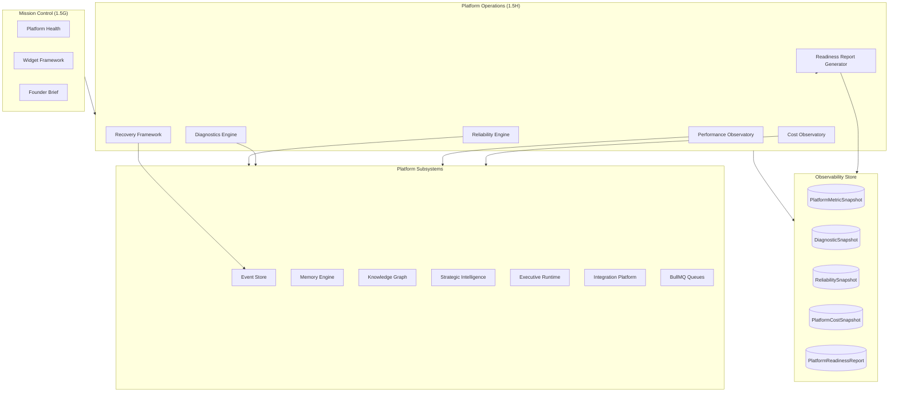
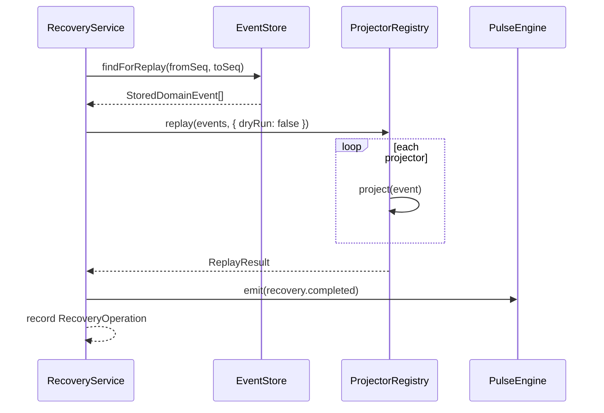
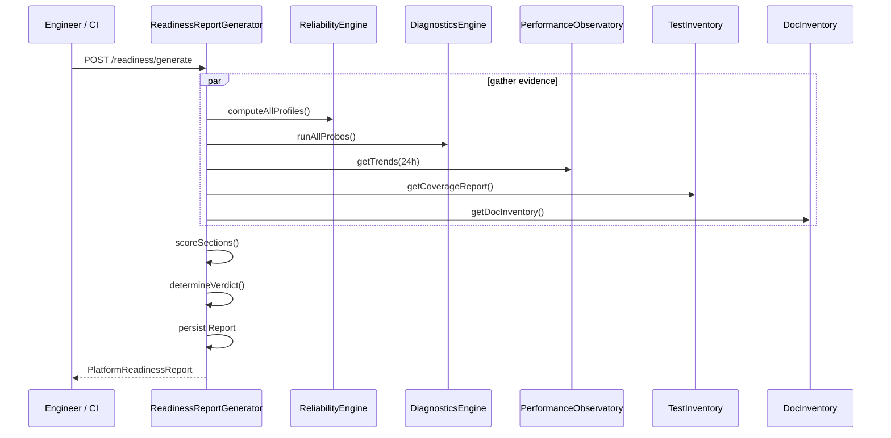

# Platform Operations & Reliability — Design Review (Phase 1.5H)

**Project:** Project Grayscale  
**Date:** 2026-07-25  
**Author:** Founding Principal Engineer / CTO  
**Status:** Review complete — **awaiting approval before implementation**  
**Prerequisites:** Phase 1.5A–1.5G ✅ — **Approved**

---

## Executive Summary

Phase 1.5H completes the **Foundation** by making Project Grayscale production-grade.

**Core thesis:** The objective is not merely monitoring — it is **trust**. Every platform subsystem must be observable, diagnosable, measurable, recoverable, and secure. Foundation is complete only when the platform can explain its own health, diagnose its own failures, recover from faults, and provide engineering evidence that executive systems can safely be introduced.

**Recommendation:** Introduce six operational frameworks — **Reliability** (AIP-33), **Diagnostics** (AIP-34), **Performance Observatory** (AIP-35), **Recovery** (AIP-36), **Platform Cost Observatory** (AIP-37), and **Platform Readiness Report** (AIP-38) — as a new `PlatformOperationsModule` that extends Mission Control without duplicating health metrics from 1.5G.

**Scale target:** Sub-200ms diagnostic aggregation, 30-day metric retention, deterministic readiness report generation in <5s, formal Sprint 2 gate with engineering evidence.

**Out of scope for 1.5H:** External APM vendors (Datadog, Grafana Cloud), multi-region DR deployment, automated alerting to PagerDuty, executive agent execution.

---

## Updated Foundation Roadmap

```
Phase 1.5F  Integration & Plugin Platform     ✅ complete
Phase 1.5G  Mission Control Live             ✅ complete
     ↓
Phase 1.5H  Platform Operations & Reliability  ← THIS REVIEW
     ↓
Platform Readiness Report (formal gate)
     ↓
FOUNDATION COMPLETE → Sprint 2 (Executive Systems)
```

**Sprint 2 is blocked until the Platform Readiness Report concludes `READY FOR SPRINT 2`.**

---

## Health vs Reliability vs Readiness

| Layer | Phase | Question | Example |
|-------|-------|----------|---------|
| **Health** | 1.5G | Is it working *right now*? | Platform Health Score 78%, pulse critical |
| **Reliability** | 1.5H | Is it meeting its *commitments*? | SLO 99.5%, error budget 12% remaining |
| **Diagnostics** | 1.5H | *Why* is something wrong? | 3 orphan graph nodes, 2 failed event projectors |
| **Performance** | 1.5H | Is it *fast enough*? | API p95 142ms, queue depth 4 |
| **Recovery** | 1.5H | Can we *fix* it deterministically? | Replay events seq 1000–1050 |
| **Platform Readiness** | 1.5H | Is the *foundation* ready for executives? | READY / NOT READY with evidence |

Company Readiness (AIP-31, 1.5G) measures **business operational maturity**. Platform Readiness (AIP-38, 1.5H) measures **engineering foundation maturity**. These are distinct and must not be conflated.

---

## Current State Assessment

| Component | Maturity | Location | Gap |
|-----------|----------|----------|-----|
| Basic liveness | ~10% | `GET /health` → `{ status: "ok" }` | No dependency checks |
| Platform health | ~60% | `PlatformHealthService` (1.5G) | No SLO/error budget; point-in-time only |
| Integration cost | ~40% | `IntegrationCostService` (1.5F) | Connector-only; no platform infra cost |
| Event replay | ~50% | `EventsService.replay()` | No UI/API workflow; no rollback |
| Event failures | ~30% | `DomainEventFailure` table | No aggregation or recovery API |
| Graph validation | ~40% | `GraphValidationService` | Not exposed via diagnostics API |
| BullMQ queues | ~20% | 4 queues registered | No depth/throughput metrics |
| Test coverage | ~25% | 66 backend + package tests | No coverage reporting gate |
| Documentation | ~70% | 12 ADRs, API docs | No automated doc completeness check |
| Platform Readiness | 0% | — | No formal Sprint 2 gate |

**Primary gap:** The platform can report health but cannot yet prove reliability, explain failures, show performance trends, recover deterministically, or gate Sprint 2 with engineering evidence.

---

## Target Architecture



**Invariant:** Operations layer **observes and acts on** subsystems; it does not own domain data.

---

## Architectural Additions

### AIP-33: Reliability Framework

Reliability metrics are **separate from health metrics**. Health answers "what is the state now?"; reliability answers "are we meeting our commitments over time?"

**Reliability contract per service:**

```typescript
interface ServiceReliabilityProfile {
  serviceId: string;
  sla: {
    availabilityTarget: number;    // e.g. 99.5
    latencyP95Ms: number;          // e.g. 500
    errorRateMax: number;          // e.g. 0.01
  };
  slo: {
    availability: number;          // measured over window
    latencyP95Ms: number;
    errorRate: number;
  };
  errorBudget: {
    total: number;                 // 100%
    consumed: number;
    remaining: number;
    burnRate: number;              // per hour
  };
  recovery: {
    rtoMinutes: number;            // Recovery Time Objective
    rpoMinutes: number;            // Recovery Point Objective
    lastRecoveryAt?: string;
  };
  window: "1h" | "24h" | "7d" | "30d";
  computedAt: string;
}
```

**Default SLO targets (Foundation):**

| Service | Availability | p95 Latency | Error Rate | RTO | RPO |
|---------|-------------|-------------|------------|-----|-----|
| event-store | 99.9% | 100ms | 0.1% | 5m | 0m |
| memory-engine | 99.5% | 200ms | 0.5% | 15m | 5m |
| knowledge-graph | 99.5% | 300ms | 0.5% | 15m | 5m |
| strategic-intelligence | 99.0% | 500ms | 1.0% | 30m | 15m |
| integration-platform | 99.0% | 2000ms | 2.0% | 60m | 30m |
| pulse-engine | 99.5% | 100ms | 0.5% | 5m | 0m |
| mission-control | 99.0% | 500ms | 1.0% | 15m | 0m |

**Error budget calculation:**

```
errorBudget.remaining = 100 - (1 - measuredAvailability) / (1 - targetAvailability) * 100
burnRate = errorBudget.consumed / windowHours
```

Mission Control widget: `reliability-dashboard` (separate from `platform-health`).

---

### AIP-34: Platform Diagnostics Framework

Every subsystem exposes standardized diagnostics via `DiagnosticsPort`.

**Diagnostic report contract:**

```typescript
interface DiagnosticFinding {
  id: string;
  subsystem: DiagnosticSubsystem;
  severity: "info" | "warning" | "error" | "critical";
  category: string;
  title: string;
  description: string;
  evidence: Record<string, unknown>;
  remediation?: string;
  detectedAt: string;
}

type DiagnosticSubsystem =
  | "memory_integrity"
  | "graph_integrity"
  | "strategy_rules"
  | "executive_runtime"
  | "plugin_sandbox"
  | "integration_sync"
  | "security"
  | "storage"
  | "queue_health"
  | "event_store";
```

**Initial diagnostic probes (1.5H):**

| Subsystem | Probe | Severity Triggers |
|-----------|-------|-------------------|
| **Memory Integrity** | Orphan memory records (no source entity), stale index rows | warning: >0 orphans |
| **Graph Integrity** | Orphan nodes, invalid edges (via `GraphValidationService`), dangling references | error: invalid edges |
| **Strategy Rule Conflicts** | Overlapping policy rules, constraint violations | warning: conflicts |
| **Executive Runtime Queue** | Pending execution requests, disabled state consistency | info when disabled |
| **Plugin Sandbox Violations** | Audit log of denied sandbox API calls | warning: >10 denials/24h |
| **Integration Sync** | Failed/stale sync jobs, auth failures | error: failed syncs |
| **Security Findings** | Plaintext tokens (should be 0), expired credentials, audit gaps | critical: plaintext |
| **Storage Health** | Table row counts, largest tables, migration status | warning: growth anomaly |
| **Queue Health** | BullMQ depth, DLQ count, stalled jobs per queue | error: DLQ > 0 |

**API:** `GET /platform/operations/diagnostics` — aggregated findings, filterable by subsystem/severity.

---

### AIP-35: Performance Observatory

Collect platform-wide metrics with historical trend storage.

**Metric categories:**

```typescript
interface PlatformMetric {
  name: string;
  category: MetricCategory;
  value: number;
  unit: string;
  labels?: Record<string, string>;
  recordedAt: string;
}

type MetricCategory =
  | "api_latency"
  | "queue_depth"
  | "worker_throughput"
  | "slow_query"
  | "cache_hit_rate"
  | "database"
  | "event_processing"
  | "memory_usage"
  | "cpu"
  | "storage"
  | "bandwidth";
```

**Collection strategy (1.5H):**

| Metric | Source | Collection |
|--------|--------|------------|
| API latency | NestJS interceptor middleware | Per-route p50/p95/p99 |
| Queue depth | BullMQ `getJobCounts()` | Poll every 60s |
| Worker throughput | BullMQ completed jobs/hour | Aggregate hourly |
| Slow queries | Prisma query logging (>100ms) | Sample and store |
| Event processing time | ProjectorRegistryService timing | Per-projector |
| Database connections | Prisma `$queryRaw` pg stat | Poll every 5m |
| Storage growth | Prisma table counts | Daily snapshot |
| Memory/CPU | `process.memoryUsage()`, `os.loadavg()` | Poll every 60s |

**Storage:** `PlatformMetricSnapshot` table with time-series rows; aggregate queries for trends (1h, 24h, 7d, 30d).

**Pulse Engine v2 enhancement:** Emit `pulse.updated` on SLO breach, diagnostic critical finding, or recovery completion.

---

### AIP-36: Recovery Framework

Deterministic recovery capabilities reusable by every subsystem.

**Recovery operation contract:**

```typescript
interface RecoveryOperation {
  id: string;
  type: RecoveryType;
  subsystem: string;
  status: "pending" | "running" | "completed" | "failed";
  parameters: Record<string, unknown>;
  result?: Record<string, unknown>;
  startedAt: string;
  completedAt?: string;
  initiatedBy?: string;
}

type RecoveryType =
  | "replay"           // Re-process domain events
  | "retry"            // Retry failed jobs/events
  | "rollback"         // Revert to prior state (event-sourced)
  | "restore"          // Restore from snapshot
  | "snapshot"         // Create point-in-time snapshot
  | "disaster_recovery" // Full platform rebuild from event log
  | "platform_rebuild"; // Rebuild projections from event store
```

**Initial recovery workflows:**

| Operation | API | Description |
|-----------|-----|-------------|
| **Replay** | `POST /platform/operations/recovery/replay` | Re-process events by sequence range (existing `EventsService.replay`) |
| **Retry** | `POST /platform/operations/recovery/retry` | Retry failed domain events from DLQ |
| **Retry Jobs** | `POST /platform/operations/recovery/retry-jobs` | Retry failed BullMQ jobs by queue |
| **Snapshot** | `POST /platform/operations/recovery/snapshot` | Capture platform state snapshot |
| **Platform Rebuild** | `POST /platform/operations/recovery/rebuild` | Rebuild all projections from event store |
| **Restore** | `POST /platform/operations/recovery/restore` | Restore from named snapshot |

**Sequence: Event Replay Recovery**



**Safety gates:**

- Replay requires explicit sequence range (no full replay without confirmation flag)
- Platform rebuild requires `confirmRebuild: true` in payload
- All recovery operations are async (platform jobs) with audit trail
- Recovery operations publish `platform.recovery.*` events

---

### AIP-37: Platform Cost Observatory

Extend integration cost monitoring (1.5F) to full platform operational costs.

**Cost categories:**

```typescript
interface PlatformCostBreakdown {
  period: string;                  // "2026-07"
  categories: {
    database: CostLine;
    queues: CostLine;
    workers: CostLine;
    storage: CostLine;
    bandwidth: CostLine;
    aiUsage: CostLine;
    connectors: CostLine;          // from IntegrationCostService
    plugins: CostLine;
    infrastructure: CostLine;
  };
  totalEstimatedCents: number;
  computedAt: string;
}

interface CostLine {
  estimatedCents: number;
  usageUnits: number;
  unit: string;
  trend: "stable" | "increasing" | "decreasing";
}
```

**Estimation model (1.5H — deterministic, not billing integration):**

| Category | Signal | Estimation |
|----------|--------|------------|
| Database | Row counts × storage bytes, connection hours | Configurable $/GB/month |
| Queues | Job count × avg payload size | Redis memory estimate |
| Workers | Completed jobs × avg processing time | CPU-second estimate |
| Storage | Prisma table sizes (pg_total_relation_size) | $/GB/month |
| AI Usage | Agent run count × token estimate | From agent_runs table |
| Connectors | IntegrationCostSnapshot (existing) | Direct from 1.5F |
| Infrastructure | Static config or env-based | Manual entry acceptable |

Mission Control widget: `platform-cost` (extends `integration-cost`).

---

### AIP-38: Platform Readiness Report

Deterministic engineering assessment — the **formal gate** between Foundation and Sprint 2.

**Report schema:**

```typescript
interface PlatformReadinessReport {
  id: string;
  version: number;
  generatedAt: string;
  verdict: "READY FOR SPRINT 2" | "NOT READY";
  sections: {
    platformFoundation: ReadinessSection;
    apiStability: ReadinessSection;
    architectureCompleteness: ReadinessSection;
    performance: ReadinessSection;
    reliability: ReadinessSection;
    security: ReadinessSection;
    documentation: ReadinessSection;
    automatedTesting: ReadinessSection;
    technicalDebt: ReadinessSection;
    knownRisks: ReadinessSection;
    coverage: ReadinessSection;
    operationalReadiness: ReadinessSection;
  };
  blockers: ReadinessBlocker[];
  evidence: ReadinessEvidence[];
  overallScore: number;           // 0–100
  minimumScore: number;            // gate threshold (default 80)
}

interface ReadinessSection {
  id: string;
  name: string;
  score: number;
  status: "pass" | "warn" | "fail";
  criteria: ReadinessCriterion[];
  evidence: string[];
}

interface ReadinessBlocker {
  id: string;
  severity: "critical" | "major";
  title: string;
  remediation: string;
}
```

**Gate criteria (must all pass for READY):**

| Section | Pass Criteria | Evidence Source |
|---------|--------------|-----------------|
| Platform Foundation | All 1.5A–1.5G phases complete | Sprint checklist |
| API Stability | All registered routes respond; 0 breaking changes | Service registry |
| Architecture Completeness | 13 ADRs accepted; all AIP decisions implemented | ADR index |
| Performance | API p95 < 500ms; queue depth < 100 | Performance Observatory |
| Reliability | All services SLO ≥ target; error budget > 0 | Reliability Engine |
| Security | 0 plaintext tokens; credential vault active; sandbox enforced | Security diagnostics |
| Documentation | All phase API docs exist; design reviews approved | Doc inventory |
| Automated Testing | ≥80% coverage on core modules; all tests pass | CI/coverage report |
| Technical Debt | 0 critical debt items; known items documented | Diagnostics |
| Known Risks | All risks documented with mitigation | Risk register |
| Coverage | Test count ≥ threshold; no untested critical paths | Test inventory |
| Operational Readiness | Recovery workflows tested; diagnostics green | Recovery + diagnostics |

**Verdict logic:**

```
if any(section.status === "fail" for critical sections) → NOT READY
if overallScore < minimumScore → NOT READY
if blockers.length > 0 where severity === "critical" → NOT READY
else → READY FOR SPRINT 2
```

**Generation:** `POST /platform/operations/readiness/generate` — deterministic, no LLM. Stored in `platform_readiness_reports` table. Mission Control widget: `foundation-readiness`.

---

## Platform Contracts (`@grayscale/platform`)

New exports under `packages/platform/src/operations/`:

```
operations/
  reliability.ts      — ServiceReliabilityProfile, ReliabilityPort
  diagnostics.ts      — DiagnosticFinding, DiagnosticsPort
  metrics.ts          — PlatformMetric, PerformanceObservatoryPort
  recovery.ts         — RecoveryOperation, RecoveryPort
  cost.ts             — PlatformCostBreakdown, PlatformCostPort
  readiness-report.ts — PlatformReadinessReport, ReadinessReportPort
  index.ts
```

---

## Backend Module Structure

```
backend/src/modules/platform-operations/
  platform-operations.module.ts
  platform-operations.controller.ts
  reliability-engine.service.ts
  diagnostics-engine.service.ts
  diagnostics/
    memory-integrity.probe.ts
    graph-integrity.probe.ts
    strategy-conflicts.probe.ts
    executive-queue.probe.ts
    sandbox-violations.probe.ts
    integration-sync.probe.ts
    security.probe.ts
    storage-health.probe.ts
    queue-health.probe.ts
  performance-observatory.service.ts
  metrics-collector.service.ts
  metrics-collector.processor.ts      — scheduled BullMQ job
  recovery.service.ts
  recovery.processor.ts
  platform-cost-observatory.service.ts
  readiness-report-generator.service.ts
  api-metrics.interceptor.ts          — NestJS global interceptor
```

Wires into existing `MissionControlModule` via new widgets; does not duplicate health logic.

---

## Prisma Additions

```prisma
model PlatformMetricSnapshot {
  id         String   @id @default(uuid())
  name       String
  category   String
  value      Float
  unit       String
  labels     Json     @default("{}")
  recordedAt DateTime @default(now()) @map("recorded_at")

  @@index([category, recordedAt])
  @@index([name, recordedAt])
  @@map("platform_metric_snapshots")
}

model DiagnosticSnapshot {
  id         String   @id @default(uuid())
  companyId  String?  @map("company_id")
  findings   Json
  summary    Json
  recordedAt DateTime @default(now()) @map("recorded_at")

  @@index([recordedAt])
  @@map("diagnostic_snapshots")
}

model ReliabilitySnapshot {
  id         String   @id @default(uuid())
  serviceId  String   @map("service_id")
  profile    Json
  window     String
  recordedAt DateTime @default(now()) @map("recorded_at")

  @@index([serviceId, recordedAt])
  @@map("reliability_snapshots")
}

model PlatformCostSnapshot {
  id                   String   @id @default(uuid())
  period               String
  breakdown            Json
  totalEstimatedCents  Int      @map("total_estimated_cents")
  recordedAt           DateTime @default(now()) @map("recorded_at")

  @@unique([period])
  @@map("platform_cost_snapshots")
}

model PlatformRecoveryOperation {
  id          String    @id @default(uuid())
  type        String
  subsystem   String
  status      String    @default("pending")
  parameters  Json      @default("{}")
  result      Json?
  error       String?
  initiatedBy String?   @map("initiated_by")
  startedAt   DateTime  @default(now()) @map("started_at")
  completedAt DateTime? @map("completed_at")

  @@index([status])
  @@map("platform_recovery_operations")
}

model PlatformReadinessReport {
  id            String   @id @default(uuid())
  version       Int      @default(1)
  verdict       String
  overallScore  Int      @map("overall_score")
  sections      Json
  blockers      Json     @default("[]")
  evidence      Json     @default("[]")
  generatedAt   DateTime @default(now()) @map("generated_at")

  @@index([generatedAt])
  @@map("platform_readiness_reports")
}

model PlatformSnapshot {
  id          String   @id @default(uuid())
  name        String
  description String?
  tables      Json     // table → row count + checksum
  createdAt   DateTime @default(now()) @map("created_at")

  @@map("platform_snapshots")
}
```

---

## API Surface

Base path: `/platform/operations`

| Method | Path | Description |
|--------|------|-------------|
| GET | `/reliability` | All service reliability profiles |
| GET | `/reliability/:serviceId` | Single service SLO/error budget |
| GET | `/diagnostics` | Aggregated diagnostic findings |
| GET | `/diagnostics/:subsystem` | Subsystem-specific diagnostics |
| GET | `/metrics` | Current metrics snapshot |
| GET | `/metrics/trends` | Historical trends (1h/24h/7d/30d) |
| GET | `/cost` | Platform cost breakdown |
| GET | `/cost/trends` | Cost trends over time |
| POST | `/recovery/replay` | Replay domain events |
| POST | `/recovery/retry` | Retry failed events |
| POST | `/recovery/retry-jobs` | Retry failed queue jobs |
| POST | `/recovery/snapshot` | Create platform snapshot |
| POST | `/recovery/rebuild` | Rebuild projections |
| GET | `/recovery` | List recovery operations |
| GET | `/recovery/:id` | Recovery operation status |
| POST | `/readiness/generate` | Generate Platform Readiness Report |
| GET | `/readiness/latest` | Latest readiness report |
| GET | `/readiness/:id` | Specific report |

See [PLATFORM_OPERATIONS_API.md](../api/PLATFORM_OPERATIONS_API.md).

---

## Mission Control Integration (New Widgets)

| Widget ID | Data Source | Purpose |
|-----------|-------------|---------|
| `reliability-dashboard` | `/platform/operations/reliability` | SLO/error budget per service |
| `diagnostics-panel` | `/platform/operations/diagnostics` | Active findings by severity |
| `performance-metrics` | `/platform/operations/metrics/trends` | Latency, queue depth trends |
| `platform-cost` | `/platform/operations/cost` | Full platform cost breakdown |
| `foundation-readiness` | `/platform/operations/readiness/latest` | Sprint 2 gate verdict |

---

## Pulse Engine v2

Enhancements building on 1.5G pulse:

| Trigger | Pulse Type | Severity |
|---------|-----------|----------|
| SLO breach | `slo.breach` | warning/critical |
| Error budget exhausted | `error_budget.exhausted` | critical |
| Diagnostic critical finding | `diagnostic.critical` | critical |
| Recovery completed | `recovery.completed` | success |
| Recovery failed | `recovery.failed` | critical |
| Readiness report generated | `readiness.report` | info |
| Readiness NOT READY | `readiness.blocked` | warning |

---

## Sequence: Platform Readiness Report Generation



---

## Relationship to Existing Phases

| Prior Phase | 1.5H Extends |
|-------------|-------------|
| 1.5A Event Store | Replay recovery, event failure diagnostics |
| 1.5B Memory Engine | Memory integrity diagnostics |
| 1.5C Knowledge Graph | Graph integrity diagnostics |
| 1.5D Strategic Intelligence | Strategy rule conflict diagnostics |
| 1.5E Executive Runtime | Queue status diagnostics (disabled gate) |
| 1.5F Integration Platform | Sync diagnostics, connector cost rollup |
| 1.5G Mission Control | New ops widgets; health ≠ reliability |

---

## Engineering Gates (1.5H)

| Gate | Criteria |
|------|----------|
| Reliability | All 11 services have SLO profiles; error budgets computed |
| Diagnostics | 9 subsystem probes operational |
| Performance | Metrics collected for 10 categories; 30-day retention |
| Recovery | Replay, retry, snapshot, rebuild workflows tested |
| Cost | 9-category cost breakdown generated |
| Readiness Report | Deterministic generation; verdict logic tested |
| Pulse v2 | 7 new pulse types on ops events |
| Tests | 80%+ coverage on platform-operations module |
| Docs | ADR-013 Accepted; API docs complete |
| Foundation Gate | Report generated with engineering evidence |

---

## Implementation Phases

| Phase | Deliverable | Estimate |
|-------|-------------|----------|
| **1.5H-a** | Platform contracts + ADR-013 | 1 day |
| **1.5H-b** | Prisma schema + migration | 1 day |
| **1.5H-c** | Reliability Engine (AIP-33) | 2 days |
| **1.5H-d** | Diagnostics Engine + 9 probes (AIP-34) | 3 days |
| **1.5H-e** | Performance Observatory + interceptor (AIP-35) | 3 days |
| **1.5H-f** | Recovery Framework (AIP-36) | 2 days |
| **1.5H-g** | Platform Cost Observatory (AIP-37) | 1 day |
| **1.5H-h** | Readiness Report Generator (AIP-38) | 2 days |
| **1.5H-i** | Pulse v2 + Mission Control widgets | 2 days |
| **1.5H-j** | Tests + generate Platform Readiness Report | 2 days |

**Total:** ~19 engineering days

---

## Approval Checklist

- [ ] AIP-33 through AIP-38 accepted or amended
- [ ] Health vs Reliability separation confirmed
- [ ] Diagnostic probe catalog confirmed
- [ ] Recovery workflow scope confirmed (replay, retry, rebuild)
- [ ] Platform Readiness gate criteria confirmed
- [ ] Sprint 2 block until READY verdict accepted
- [ ] API surface confirmed
- [ ] Proceed to implementation

---

## References

- [ADR-013: Platform Operations & Reliability](./ADR-013-platform-operations-reliability.md)
- [Platform Operations API](../api/PLATFORM_OPERATIONS_API.md)
- [Platform Readiness Report Template](../engineering/PLATFORM_READINESS_REPORT.md)
- [Mission Control Design Review (1.5G)](./MISSION_CONTROL_DESIGN_REVIEW.md)
- [ADR-012: Mission Control Live](./ADR-012-mission-control-live.md)
- [ADR-006: Event Store](./ADR-006-event-store.md)
