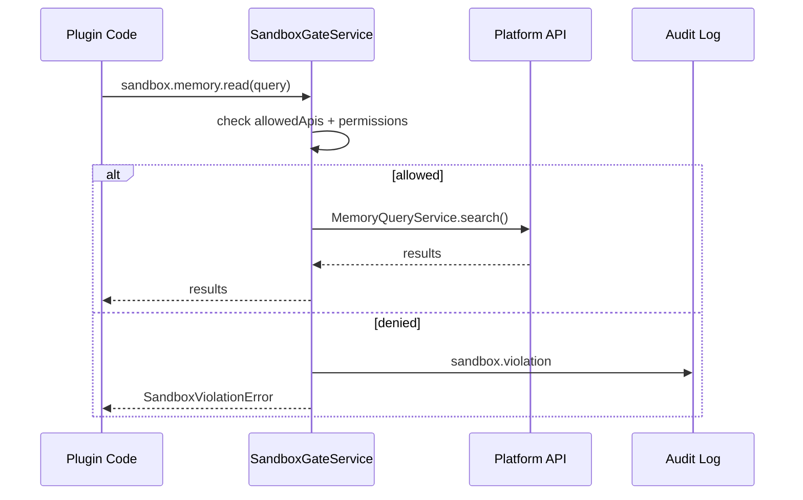

# Plugin Sandbox Model

Phase 1.5F — isolation model for plugin execution.

## Principle

**Deny all by default.** Every plugin receives a sandbox policy at install time. No unrestricted platform access.

## Sandbox Policy

```typescript
interface PluginSandboxPolicy {
  pluginId: string;
  companyId: string;

  // API access
  allowedApis: SandboxApi[];

  // Event access
  allowedEvents: PlatformEventType[];      // publish
  allowedSubscriptions: PlatformEventType[]; // subscribe

  // Executive access
  allowedExecutives: string[];             // "*" or explicit IDs

  // Storage
  allowedStorage: {
    maxBytes: number;
    ttlSeconds: number;
  };

  // Permissions (mirrors PluginPermission[])
  allowedPermissions: string[];

  // Network (via connector only)
  networkPolicy: "none" | "provider_only" | "allowlist";
  networkAllowlist?: string[];
}
```

## Sandbox APIs

| API | Description |
|-----|-------------|
| `memory.read` | Read memory records (scoped to company) |
| `memory.write` | Create memory records |
| `graph.read` | Read graph nodes/edges |
| `events.publish` | Publish allowed event types |
| `integration.sync` | Trigger sync for own connector |
| `integration.read` | Read own integration health |
| `settings.read` | Read plugin settings |
| `settings.write` | Update plugin settings |
| `storage.get` | Plugin-scoped key-value storage |
| `storage.set` | Plugin-scoped key-value storage |

**Not available to plugins:**
- Direct Prisma/database access
- Raw credential access
- Other plugins' settings
- Executive runtime internals
- Unrestricted HTTP

## Enforcement



`SandboxGateService` wraps all plugin API access. Violations:
1. Log to audit
2. Set plugin state to `degraded`
3. Emit pulse alert
4. Return structured error (no silent failure)

## Default Policies

| Plugin Type | Default APIs |
|-------------|--------------|
| Integration plugin | `integration.*`, `events.publish`, `memory.write`, `graph.read` |
| Notification plugin | `events.publish`, `memory.read` |
| Analytics plugin | `memory.read`, `graph.read`, `events.publish` |

First-party plugins (`io.grayscale.*`) may receive expanded grants at install — still explicit, never implicit.

## Storage Isolation

Plugin storage namespace: `{companyId}:{pluginId}:{key}`

- Max 1MB per plugin per company (configurable)
- TTL 90 days default
- Deleted on uninstall

## Testing Sandbox

```typescript
// Test helper
const sandbox = createTestSandbox({
  allowedApis: ["memory.read"],
  allowedEvents: ["integration.sync.completed"],
});
await expect(sandbox.graph.read()).rejects.toThrow(SandboxViolationError);
```

See [PLUGIN_SDK_SPECIFICATION.md](../platform/PLUGIN_SDK_SPECIFICATION.md) · [PLUGIN_SECURITY_MODEL.md](./PLUGIN_SECURITY_MODEL.md).
