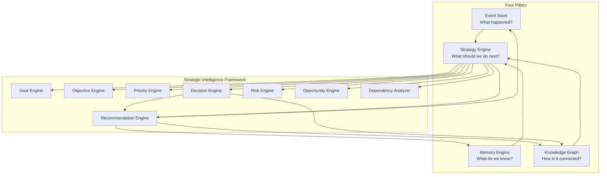
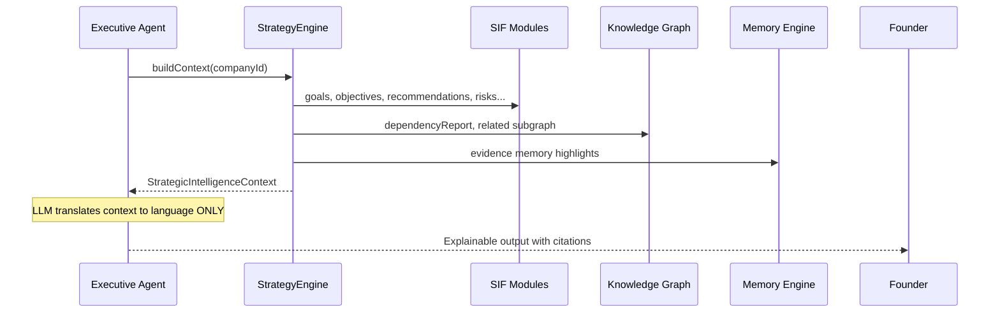
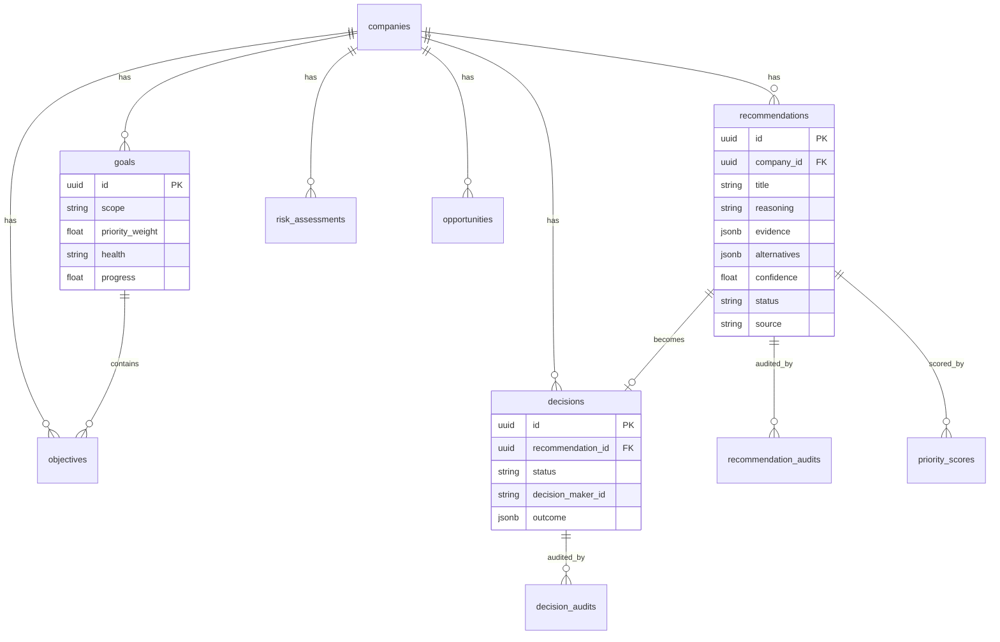

# Strategic Intelligence Framework — Design Review (Phase 1.5D)

**Project:** Project Grayscale  
**Date:** 2026-07-25  
**Author:** Founding Principal Engineer / CTO  
**Status:** Review complete — **awaiting approval before implementation**  
**Prerequisites:** Phase 1.5A (Event Store) ✅ · 1.5B (Memory Engine) ✅ · 1.5C (Knowledge Graph) ✅ — **Approved**

---

## Executive Summary

Phase 1.5D expands beyond a standalone Recommendation Framework into the **Strategic Intelligence Framework (SIF)** — the common decision-making engine every future executive inherits.

**Core thesis:** The LLM is not the intellectual foundation of Project Grayscale. **Structured strategic reasoning is.** Executives in Sprint 2+ translate SIF outputs into language; they never invent priority, risk, or dependency logic independently.

**Recommendation:** Build **eight provider-agnostic engines** (Goals, Objectives, Priority, Recommendations, Decisions, Risks, Opportunities, Dependencies) orchestrated by the **Strategy Engine** (fourth pillar). Persist structured entities in Postgres, integrate with Memory + Graph + Event Store, expose Mission Control summary APIs. **Zero LLM execution. Zero executive personalities.**

**Scale target:** Thousands of companies, millions of recommendations/decisions, sub-200ms priority scoring per company batch.

---

## Platform Pillars (Complete Model)



| Pillar | Responsibility | Does NOT |
|--------|----------------|----------|
| Event Store | Immutable history, replay, audit | Score priorities or recommend actions |
| Memory Engine | Searchable organizational knowledge | Determine strategy |
| Knowledge Graph | Typed relationships, traversal | Store recommendation payload |
| Strategy Engine | Orchestrate SIF modules, assemble context | Generate natural language |

---

## Mission & Core Responsibility

The Strategic Intelligence Framework determines:

| Question | Owner Module |
|----------|--------------|
| What should happen? | Recommendation Engine |
| Why? | Recommendation + Evidence |
| When? | Priority Engine + Objectives |
| In what order? | Priority Engine (ranking) |
| At what cost? | Recommendation (cost) + Risk Engine |
| With what risks? | Risk Engine |
| What dependencies exist? | Dependency Analyzer |
| What alternatives exist? | Recommendation (alternatives) |
| What expected outcome? | Recommendation + Decision (outcome) |

**Invariant:** SIF outputs **structured JSON entities** — never prose. Language generation is an executive adapter concern (Sprint 2+).

---

## Explainable AI Principle (NON_NEGOTIABLES #3)

Every recommendation must answer:

| Field | Required |
|-------|----------|
| What? | `title`, `summary` |
| Why? | `reasoning` |
| Evidence? | `evidence[]` with source refs |
| Confidence? | `confidence` (0–1) + band |
| Risk? | linked `RiskAssessment[]` |
| Cost? | `estimatedCostCents?`, `engineeringCost?` |
| Expected ROI? | `estimatedRoi` |
| Dependencies? | `dependencyIds[]` + graph edges |
| Alternatives? | `alternatives[]` |
| Expected timeline? | `expectedTimeline?` |
| Rollback plan? | `rollbackStrategy?` |

Black-box outputs are **rejected at the schema level** — required fields enforced by validation, not convention.

---

## Framework Modules

### 1. Goal Engine

**Purpose:** North-star alignment for company, departments, and founder.

```typescript
interface Goal {
  id: string;
  companyId: string;
  scope: "company" | "department" | "founder";
  department?: string;
  title: string;
  description?: string;
  successCriteria: SuccessCriterion[];
  priorityWeight: number;        // 0–1, founder-configurable
  status: GoalStatus;            // active | paused | achieved | abandoned
  health: GoalHealth;            // on_track | at_risk | off_track
  progress: number;              // 0–100
  milestoneIds: string[];
  dependencyGoalIds: string[];
  ownerId?: string;
  deadline?: string;
  metadata: Record<string, unknown>;
  createdAt: string;
  updatedAt: string;
}

type GoalStatus = "active" | "paused" | "achieved" | "abandoned";
type GoalHealth = "on_track" | "at_risk" | "off_track" | "unknown";

interface SuccessCriterion {
  id: string;
  description: string;
  metric?: string;
  target?: string;
  current?: string;
}
```

**Events:** `goal.created`, `goal.updated`, `goal.health_changed`  
**Graph:** Goal → `graph_nodes` (`nodeType: project` or synthetic `goal` node — see AIP-11)

---

### 2. Objective Engine

**Purpose:** Measurable steps toward goals.

```typescript
interface Objective {
  id: string;
  companyId: string;
  goalId: string;
  title: string;
  description?: string;
  status: ObjectiveStatus;
  completion: number;            // 0–100
  deadline?: string;
  ownerId?: string;
  dependencyObjectiveIds: string[];
  linkedProjectIds: string[];
  linkedTaskIds: string[];
  metadata: Record<string, unknown>;
}

type ObjectiveStatus = "not_started" | "in_progress" | "blocked" | "completed" | "cancelled";
```

**Graph edges:** Objective `PART_OF` Goal, Objective `DEPENDS_ON` Objective, Objective `BELONGS_TO` Project

---

### 3. Priority Engine

**Purpose:** Configurable, auditable priority scoring — **rule-based in 1.5D**, ML-ready interface later.

```typescript
interface PriorityInput {
  entityType: "recommendation" | "objective" | "goal" | "risk" | "opportunity";
  entityId: string;
  businessValue: number;         // 0–1
  founderPriority: number;     // 0–1
  revenueImpact: number;       // 0–1
  riskScore: number;           // 0–1 (higher = more risk)
  dependencyBlockers: number;  // count
  timeSensitivity: number;     // 0–1
  engineeringCost: number;   // 0–1 (higher = more expensive)
}

interface PriorityScore {
  id: string;
  companyId: string;
  entityType: string;
  entityId: string;
  score: number;               // 0–100
  rank?: number;
  reasoning: PriorityReasoning;
  weights: PriorityWeights;    // snapshot of config used
  computedAt: string;
}

interface PriorityReasoning {
  summary: string;
  factors: { name: string; value: number; weight: number; contribution: number }[];
}
```

**Default formula (configurable per company):**

```
score = (
  businessValue      × w_bv +
  founderPriority    × w_fp +
  revenueImpact      × w_ri +
  timeSensitivity    × w_ts
) × (1 - riskScore × w_risk)
  × (1 / (1 + dependencyBlockers × w_dep))
  × (1 - engineeringCost × w_cost)
) × 100
```

**Port:** `PriorityEnginePort.compute(input)` → `PriorityScore`  
**Persistence:** `priority_scores` table for audit/replay

---

### 4. Recommendation Engine (AIP-4 evolved)

**Purpose:** First-class strategic recommendations — decoupled from `AgentRun`.

```typescript
interface Recommendation {
  id: string;
  companyId: string;
  title: string;
  summary: string;
  reasoning: string;
  evidence: RecommendationEvidence[];
  alternatives: RecommendationAlternative[];
  dependencies: string[];              // recommendation or entity ids
  riskAssessmentIds: string[];
  estimatedCostCents?: number;
  engineeringCost?: number;            // 0–1 normalized
  estimatedRoi?: string;
  confidence: number;
  confidenceBand: ConfidenceBand;
  priorityScoreId?: string;
  department?: string;
  source: RecommendationSource;
  sourceRef?: string;                  // agentRunId, pluginId, ruleId
  requiresApproval: boolean;
  status: RecommendationStatus;
  expectedOutcome?: string;
  expectedTimeline?: string;
  rollbackStrategy?: string;
  graphNodeId?: string;
  memoryRecordIds: string[];
  timelineEventIds: string[];
  createdBy: string;                   // userId | "system" | executiveId
  createdAt: string;
  updatedAt: string;
}

type RecommendationSource = "system" | "plugin" | "founder" | "executive" | "rule";
type RecommendationStatus = "draft" | "pending_approval" | "approved" | "rejected" | "amended" | "implemented" | "superseded";
type ConfidenceBand = "verified" | "high" | "medium" | "low" | "unknown";

interface RecommendationEvidence {
  id: string;
  type: "memory" | "event" | "graph" | "metric" | "document";
  refId: string;
  summary: string;
  weight: number;
}

interface RecommendationAlternative {
  id: string;
  title: string;
  summary: string;
  tradeoffs: string;
  estimatedCostCents?: number;
}
```

**Audit:** `recommendation_audits` — every status transition logged  
**Events:** `recommendation.generated`, `recommendation.approved`, `recommendation.rejected`  
**Graph:** Recommendation node + `RECOMMENDED_BY`, `DEPENDS_ON`, `REFERENCES` edges  
**Rule-based seed:** Billing overdue → system recommendation (before any executive exists)

---

### 5. Decision Engine

**Purpose:** Every approved recommendation becomes a traceable decision.

```typescript
interface Decision {
  id: string;
  companyId: string;
  recommendationId?: string;
  title: string;
  status: DecisionStatus;
  alternativesConsidered: RecommendationAlternative[];
  decisionMakerId: string;
  decisionDate: string;
  reasoning: string;
  evidence: RecommendationEvidence[];
  approvalIds: string[];
  implementationState: ImplementationState;
  outcome?: DecisionOutcome;
  reviewDate?: string;
  graphNodeId?: string;
  createdAt: string;
  updatedAt: string;
}

type DecisionStatus = "proposed" | "approved" | "implemented" | "reviewed" | "reversed";
type ImplementationState = "not_started" | "in_progress" | "completed" | "failed";

interface DecisionOutcome {
  summary: string;
  success: boolean;
  measuredAt: string;
  metrics?: Record<string, unknown>;
}
```

**Graph:** Decision node (`nodeType: decision`) — answers *"Why did we choose PostgreSQL?"*  
**Links:** Decision `REFERENCES` ADR/Memory/GitCommit/Meeting via graph edges

---

### 6. Risk Engine

**Purpose:** Structured risk assessments attachable to recommendations, goals, projects.

```typescript
type RiskCategory =
  | "technical"
  | "financial"
  | "operational"
  | "security"
  | "legal"
  | "delivery"
  | "reputation";

interface RiskAssessment {
  id: string;
  companyId: string;
  category: RiskCategory;
  title: string;
  description: string;
  severity: "low" | "medium" | "high" | "critical";
  likelihood: number;          // 0–1
  impact: number;              // 0–1
  score: number;               // likelihood × impact
  mitigation?: string;
  linkedEntityType?: string;
  linkedEntityId?: string;
  source: "system" | "founder" | "rule" | "executive";
  createdAt: string;
}
```

**Rule-based seeds:** Overdue bills → financial risk; failed integration sync → operational risk

---

### 7. Opportunity Engine

**Purpose:** Detect and track positive strategic openings.

```typescript
type OpportunityCategory =
  | "cost_saving"
  | "revenue"
  | "automation"
  | "growth"
  | "technical_improvement"
  | "operational_improvement";

interface Opportunity {
  id: string;
  companyId: string;
  category: OpportunityCategory;
  title: string;
  description: string;
  estimatedValueCents?: number;
  confidence: number;
  linkedRecommendationId?: string;
  status: "identified" | "evaluating" | "pursuing" | "captured" | "dismissed";
  source: "system" | "plugin" | "founder" | "rule";
  createdAt: string;
}
```

---

### 8. Dependency Analyzer

**Purpose:** Cross-entity dependency analysis using Knowledge Graph + strategic entities.

```typescript
interface DependencyReport {
  companyId: string;
  generatedAt: string;
  blockedProjects: BlockedEntity[];
  blockedTasks: BlockedEntity[];
  crossProjectDependencies: DependencyChain[];
  billDependencies: DependencyChain[];
  pluginDependencies: DependencyChain[];
  executiveDependencies: DependencyChain[];  // future
  summary: {
    totalBlockers: number;
    criticalPathLength: number;
  };
}

interface BlockedEntity {
  entityType: string;
  entityId: string;
  displayName: string;
  blockedBy: { type: string; id: string; relationship: string }[];
}

interface DependencyChain {
  rootId: string;
  chain: { nodeId: string; nodeType: string; relationship: string }[];
  depth: number;
}
```

**Implementation:** Wraps `GraphTraversalService` + strategic entity queries — no duplicate graph storage.

---

## Strategy Engine Orchestration

The Strategy Engine **coordinates** modules; it does not own their tables or algorithms.

```typescript
interface StrategyEnginePort {
  /** Assemble full strategic context for executives / Mission Control */
  buildContext(companyId: string): Promise<StrategicIntelligenceContext>;

  /** Run analysis pass — risks, opportunities, dependencies */
  analyze(companyId: string): Promise<StrategyAnalysisResult>;

  /** Compute priority rankings across open recommendations/objectives */
  prioritize(companyId: string): Promise<PriorityRankingResult>;

  /** Generate rule-based recommendations (no LLM) */
  evaluateRules(companyId: string): Promise<Recommendation[]>;
}

interface StrategicIntelligenceContext {
  companyId: string;
  goals: Goal[];
  objectives: Objective[];
  openRecommendations: Recommendation[];
  pendingDecisions: Decision[];
  topRisks: RiskAssessment[];
  topOpportunities: Opportunity[];
  dependencyReport: DependencyReport;
  priorityMatrix: PriorityScore[];
  companyReadiness: CompanyReadiness;
  graphSummary: GraphSummary;
  memoryHighlights: MemoryRecord[];
  recentEvents: PlatformEvent[];
  assembledAt: string;
}

interface CompanyReadiness {
  score: number;               // 0–100 composite
  factors: { name: string; score: number; weight: number }[];
}
```

**Executive consumption (Sprint 2+):**



**Executives never call** `prisma.recommendation.findMany()` directly.

---

## Storage Model

### New Tables (Postgres)

| Table | Purpose |
|-------|---------|
| `goals` | Company/department/founder goals |
| `objectives` | Goal-aligned objectives |
| `recommendations` | First-class recommendations (AIP-4) |
| `recommendation_audits` | Approval/status history |
| `decisions` | Decision records |
| `decision_audits` | Decision lifecycle audit |
| `risk_assessments` | Structured risks |
| `opportunities` | Detected opportunities |
| `priority_scores` | Computed priority audit trail |
| `priority_configs` | Per-company weight configuration |

### Migration from `agent_recommendations`

| Legacy | Target |
|--------|--------|
| `AgentRecommendation` | `recommendations` with `source: "executive"`, `sourceRef: agentRunId` |
| `approvalStatus` | `recommendation_audits` + `status` |
| Missing evidence/alternatives | Empty arrays; backfill optional |

**`agent_recommendations` deprecated** — read-only compatibility view for one release, then drop.

### Entity Relationship Diagram



### Integration (not duplication)

| Integration | Mechanism |
|-------------|-----------|
| Memory | `memoryRecordIds[]` on recommendations; evidence refs |
| Graph | `graphNodeId` + `StrategicGraphProjector` creates nodes/edges |
| Events | Domain events trigger rule evaluation + audit |
| Timeline | `timelineEventIds[]`; decision events → timeline projector |

---

## Architecture Improvement Proposals

### AIP-10: Strategic Intelligence as Modular Engines (not monolith)

**Proposal:** Eight independent NestJS modules under `backend/src/modules/intelligence/`, each implementing a platform port. Strategy Engine is a thin orchestrator.

**Why:** Testability, independent evolution, executives inherit one framework not eight ad-hoc services.

### AIP-11: Synthetic Graph Nodes for Strategic Entities

**Proposal:** Goals, Recommendations, Decisions, Risks get `graph_nodes` entries with `sourceTable: "goals" | "recommendations" | "decisions" | "risk_assessments"`.

**Why:** Dependency Analyzer and executives traverse one graph — not parallel relationship stores.

### AIP-12: Rule-Based Intelligence First, LLM Never Inside SIF

**Proposal:** `RuleEvaluatorService` runs deterministic rules (billing, integration health, goal deadlines). LLM executives consume output in Sprint 2+ only.

**Why:** Explainability, cost, NON_NEGOTIABLES #3 compliance.

### AIP-13: Priority Config Per Company

**Proposal:** Founders tune weights in `priority_configs`; every score stores weight snapshot for audit.

**Why:** Same recommendation ranks differently per company stage — but scoring remains reproducible.

---

## Mission Control Summary APIs

Base: `/companies/:companyId/intelligence`

| Endpoint | Response |
|----------|----------|
| `GET /summary` | Full `StrategicIntelligenceContext` (lightweight) |
| `GET /goals` | Active goals + health |
| `GET /objectives` | Objectives by goal |
| `GET /recommendations?status=pending_approval` | Recommendation queue |
| `GET /decisions?status=proposed` | Decision queue |
| `GET /risks?severity=high` | Risk overview |
| `GET /opportunities` | Opportunity overview |
| `GET /priority-matrix` | Ranked entities |
| `GET /readiness` | `CompanyReadiness` composite |

No dashboards — reusable JSON only (wired in 1.5G).

---

## Package Structure

```
packages/platform/src/
  strategy/           # Orchestrator ports (extend existing)
  intelligence/
    goals.ts
    objectives.ts
    priority.ts
    recommendations.ts
    decisions.ts
    risks.ts
    opportunities.ts
    dependencies.ts

backend/src/modules/intelligence/
  intelligence.module.ts
  strategy-engine.service.ts      # Orchestrator
  goal-engine.service.ts
  objective-engine.service.ts
  priority-engine.service.ts
  recommendation-engine.service.ts
  decision-engine.service.ts
  risk-engine.service.ts
  opportunity-engine.service.ts
  dependency-analyzer.service.ts
  rule-evaluator.service.ts
  strategic-graph.projector.ts
  intelligence.controller.ts
```

---

## Rule-Based Seeds (Phase 1.5D scope)

| Trigger | Module | Output |
|---------|--------|--------|
| Bill overdue event | Recommendation + Risk | "Pay overdue bill" + financial risk |
| Integration sync failed | Recommendation + Risk | "Fix integration" + operational risk |
| Goal deadline < 7 days, progress < 50% | Risk + Recommendation | Goal at-risk |
| Graph orphan nodes > threshold | Opportunity | "Connect isolated knowledge" |
| Open critical risks > 3 | CompanyReadiness | Lower readiness score |

---

## Alternatives Considered

| Alternative | Verdict |
|-------------|---------|
| **LLM-as-Strategy-Engine** | Rejected — violates explainability, cost, executive rule |
| **Extend AgentRecommendation in place** | Rejected — schema too narrow, coupled to AgentRun |
| **Single `strategic_entities` polymorphic table** | Rejected — loses type safety, complicates validation |
| **External decision engine (Camunda, etc.)** | Rejected — ops complexity for startup stage |
| **Priority via manual founder sort only** | Rejected — doesn't scale; scoring needed with override |
| **Graph-only recommendations (no table)** | Rejected — recommendations need rich payload + audit |

---

## Trade-offs

| Decision | Benefit | Cost |
|----------|---------|------|
| Eight modules vs one service | Modularity, testability | More files, orchestration overhead |
| Rule-based first | Explainable, $0 inference | Less "magic" until Sprint 2 executives |
| Priority score persistence | Audit/replay | Storage growth |
| Decouple from AgentRun | Founders get value pre-executives | Migration from legacy table |
| Full recommendation schema upfront | No schema churn | Wider rows, many nullable fields initially |

---

## Scalability

| Metric | 1.5D target | Approach |
|--------|-------------|----------|
| Recommendations / company | 10,000 | Indexed by `(companyId, status)` |
| Priority recomputation | < 500ms / company | Batch scoring, cached config |
| Dependency analysis | < 1s / company | Graph traversal depth cap |
| Audit rows | Unbounded | Partition by month (Sprint 2) |

---

## Testing Strategy (80%+ coverage)

| Module | Unit | Integration |
|--------|------|-------------|
| PriorityEngine | formula, weights, edge cases | config snapshot |
| RecommendationEngine | CRUD, status machine, validation | audit trail |
| DecisionEngine | recommendation → decision flow | graph linking |
| RiskEngine | severity scoring | rule triggers |
| DependencyAnalyzer | mock graph | seeded graph |
| RuleEvaluator | each rule in isolation | event → recommendation |
| StrategyEngine | context assembly | full pipeline |
| StrategicGraphProjector | event mapping | projector registry |

---

## Implementation Sub-Phases (~10 days)

| Phase | Deliverable | Est. |
|-------|-------------|------|
| **1.5D-0** | Platform intelligence contracts + extend strategy ports | 1d |
| **1.5D-1** | Prisma schema + migrate AgentRecommendation | 1d |
| **1.5D-2** | Goal + Objective engines | 1d |
| **1.5D-3** | Priority engine + config | 1.5d |
| **1.5D-4** | Recommendation + Decision engines + audits | 2d |
| **1.5D-5** | Risk + Opportunity engines | 1d |
| **1.5D-6** | Dependency analyzer + Rule evaluator | 1.5d |
| **1.5D-7** | Strategy Engine orchestrator + graph projector | 1d |
| **1.5D-8** | Mission Control APIs + tests + docs | 1.5d |

---

## Executive Rule (Enforced)

| Gate | Phase 1.5D |
|------|------------|
| Executive agents | ❌ Not implemented |
| LLM prompts | ❌ Not in SIF |
| Autonomous execution | ❌ Forbidden |
| `EXECUTIVES_ENABLED` freeze | Remains 1.5E scope |
| ExecutiveBase class | 1.5E — consumes SIF context |

---

## Success Criteria — Phase 1.5D

- [ ] Eight intelligence engines operational with platform ports
- [ ] Strategy Engine orchestrates modules into `StrategicIntelligenceContext`
- [ ] Recommendations decoupled from `AgentRun` (AIP-4)
- [ ] Decisions traceable with evidence and graph links
- [ ] Priority scoring configurable and auditable
- [ ] Rule-based recommendations from billing/integration events
- [ ] Dependency analyzer uses Knowledge Graph
- [ ] Mission Control intelligence summary APIs
- [ ] Every recommendation satisfies explainability schema
- [ ] Zero LLM / executive logic
- [ ] 80%+ test coverage on intelligence modules
- [ ] ADR-009 + API documentation

---

## Decisions Required

**Approve this design to begin Phase 1.5D implementation.**

Confirm or adjust:

1. **AIP-10** — Eight modular engines under Strategy Engine orchestrator
2. **AIP-11** — Strategic entities as graph nodes
3. **AIP-12** — Rule-based intelligence only (no LLM in SIF)
4. **AIP-13** — Per-company priority weight configuration
5. **Migrate `agent_recommendations`** → `recommendations` (deprecate legacy)
6. **Sub-phase ordering** — any reprioritization?

---

**Related:** [KNOWLEDGE_GRAPH_DESIGN_REVIEW.md](./KNOWLEDGE_GRAPH_DESIGN_REVIEW.md) · [ADR-008](./ADR-008-knowledge-graph.md) · [NON_NEGOTIABLES.md](../NON_NEGOTIABLES.md) · [SPRINT_1_5_CORE_PLATFORM.md](../engineering/SPRINT_1_5_CORE_PLATFORM.md)
